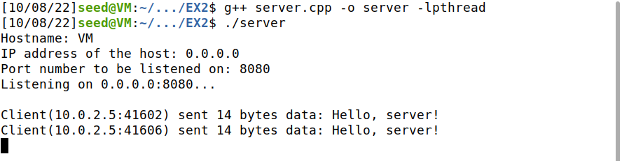

# 分布式系统系统设计-实验2

## 目录
- [分布式系统系统设计-实验2](#分布式系统系统设计-实验2)
  - [目录](#目录)
  - [实验思路](#实验思路)
    - [1. 已实现的功能](#1-已实现的功能)
    - [2. 新增功能 \& 需求分析](#2-新增功能--需求分析)
    - [3. 具体实现](#3-具体实现)
  - [演示](#演示)
    - [1. 网络信息](#1-网络信息)
    - [2. 运行程序](#2-运行程序)
    - [3. 建立连接](#3-建立连接)
    - [4. 运行结果](#4-运行结果)
    - [5. 释放连接](#5-释放连接)
  - [不足 \& 改进](#不足--改进)

## 实验思路

### 1. 已实现的功能

在实验1中，已经完成了基本的client端和server端的程序，以实现的功能如下：

- server端运行程序，自动创建socket并完成绑定，开始监听，默认监听0.0.0.0
- client端运行程序，输入server的ip地址和端口号，请求连接
- server收到请求后，与client建立起连接
- client端输入任意字符串，通过socket发送到server
- server收到字符串后，打印内容与来源（client的ip地址+端口号）
- client端输入quit释放连接
- server端收到quit释放连接

### 2. 新增功能 & 需求分析

- “支持多个client同时连接到server”
  - 需要server端程序改为多线程，每收到一个连接请求就新创建一个线程来处理，在遇到异常或释放连接时退出该线程
- “client每次向server发送一个学生的姓名（字符串）、学号（字符串）和成绩（浮点数）”
  - 需要在server与client之间约定一个标识符来表明所发送的这条消息是学生成绩，这里选择用 ```SCORE <姓名> <学号> <成绩>``` 的格式
- “server收到三个学生的成绩后计算平均分”
  - 首先需要server端程序接受并处理client发来的消息，以空格为分隔符，对字符串进行分割，若分割得到的第一个串为“SCORE”，则继续分割，将后面几个串按姓名、学号、成绩的顺序存储；若不是“SCORE”，就按照普通字符串处理，仅打印
  - 因为是多线程，所以应存储在一个每个线程都可访问到的全局变量中
  - 当存储够3个学生的信息后，计算平均分，并将结果通过socket发送到相关的client，所以要求client端程序也具有读取、打印功能
  - 在完成上一条的发送后，应将计数器归零，重新接收、存储

### 3. 具体实现

- [server.cpp](./server.cpp)
- [client.cpp](./client.cpp)

## 演示

没有找其他同学做测试，是在两个虚拟机中进行的。

- 平台：Ubuntu-20.04 和 Lubuntu-22.04
- 网络连接方式：NAT

### 1. 网络信息

- Server：10.0.2.4


- Client：10.0.2.5


### 2. 运行程序

- Server：显示为正在监听0.0.0.0:8080


- Client：输入server的ip地址与端口号
（client端运行了两个进程）


### 3. 建立连接

- Server：收到了两个建立连接的请求，可以看到端口号不同，表明是不同进程


- Client：收到了server发送的提示消息


### 4. 运行结果

两个client轮流发送学生信息，server收到并显示，计数达到3后计算平均分并发送回client
(96 + 81 + 90) / 3 = 89
计算正确


### 5. 释放连接

client端输入 ```quit``` 释放连接


## 不足 & 改进

- client端的发送与接收不能够同时进行，程序中写的是在发送后进入接收状态，然后进入下一轮循环，阻塞在发送状态等待输入。这样就会产生不能及时接收消息的问题，比如在server返回结果时，只有发送了最后一个学生信息的client端进程能够立刻接收到，其他进程需要再发送一条消息才能够读出缓冲区中的结果。但也不是简单的多线程能够解决的，发送消息时等待用户输入是一定会出现的，想到的解决办法只有弹出两个终端，分别对应发送与接收线程
- 没有在代码中加入只将结果发送给相关client的逻辑，需要建立起学生学号与client_socket的对应关系，在发送时完成相应的比对检查
