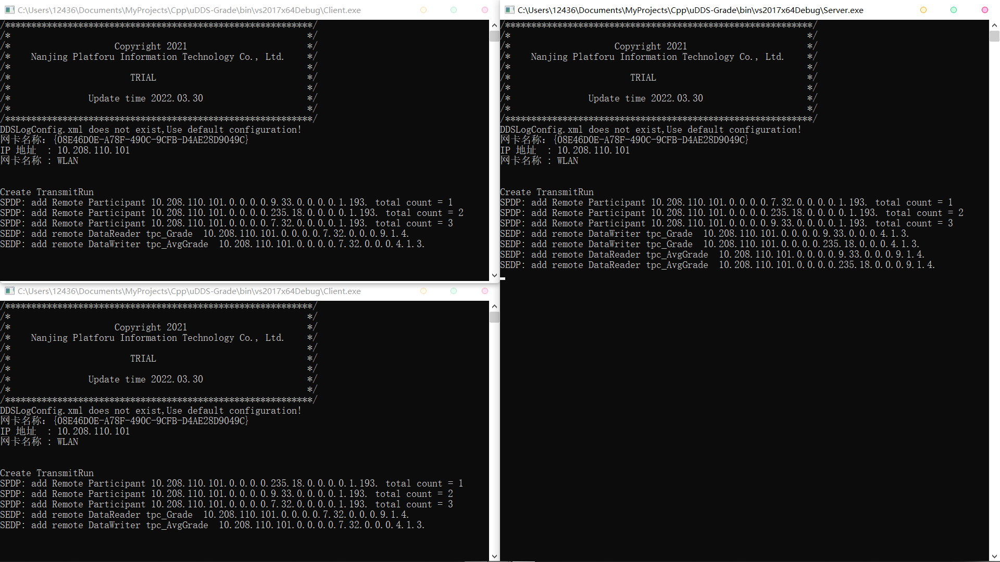
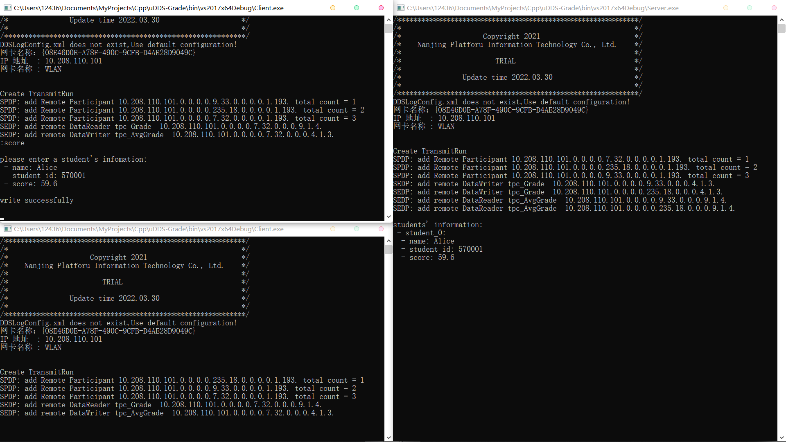
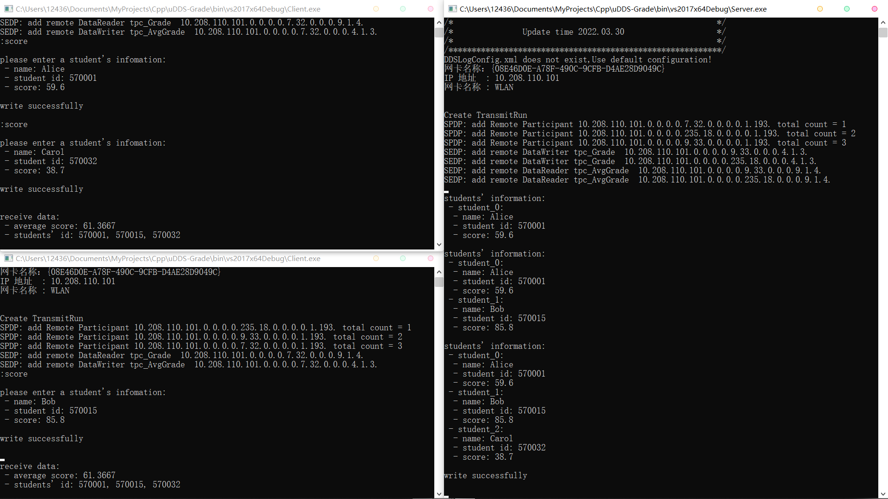
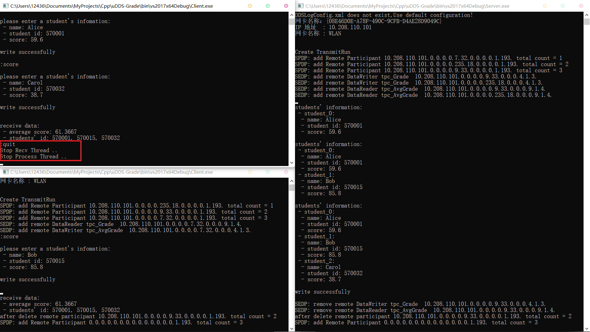

# 分布式系统系统设计-实验3

## 目录

- [分布式系统系统设计-实验3](#分布式系统系统设计-实验3)
  - [目录](#目录)
  - [实验思路](#实验思路)
    - [1. 需求分析](#1-需求分析)
    - [2. 具体实现](#2-具体实现)
  - [演示](#演示)
    - [1. 运行程序](#1-运行程序)
    - [2. 发送消息](#2-发送消息)
    - [3. 退出程序](#3-退出程序)
  - [遇到的问题 \& 解决措施](#遇到的问题--解决措施)

## 实验思路

### 1. 需求分析

通过对 uDDS 所提供的示例程序和相应源代码的学习、分析，了解了 uDDS 大致的工作原理。

要先创建一个“参与者”（participant），再从参与者根据收、发消息的需求，创建出“发布者”（publisher）或“订阅者”（subscriber）。

在进行消息的收、发之前，需要先注册数据类型、创建消息主题。

接下来，对于收、发有不同的操作。若要接收消息，需要创建一个监听器，并根据消息中的数据类型和需求重写监听器中的函数；若要发送消息，需要创建一个数据样本，进行赋值后进行发送。在收、发消息之后需要删除相应的 reader 和 writer 。

以上是一个 uDDS 程序基本的工作流程，下面是针对本实验要求的设计。

在实验2中，我的设计是使用多线程来处理多个 client 的连接请求，而在使用 uDDS 中发现是不需要用多线程的，其本身已经支持了多个参与者的连接。

所以只要将 server 端程序设计为在主循环中监听，接收 Grade 类型数据，当计数器达到设定的数值时，计算出平均分，发送 AverageGrade 类型数据给其他参与者（client），之后将计数器归零，重新进行接受、存储的过程。

对于 client 端程序，在实验2中一直没能解决的问题是总是不能及时将 server 发回来的消息打印出来，使用多线程也没能解决，所以在使用 uDDS 中换了一种思路：改为在主循环中监听，等待接收 server 发来的 AverageGrade 类型数据。当用户有输入时，暂停循环来处理用户的输入。这里使用了 ```"conio.h"``` 中的 ```_kbhit()``` 来检测键盘输入，并且规定了两个命令：```:quit``` 用于安全退出进程（这个同样也用在了 server 端程序中）；```:score``` 用于输入一个学生的信息并发送。

总的来说，server 端和 client 端程序的大致结构是相同的，均为在主循环中监听，有事件触发后暂停（client：用户输入；server：计数达到指定值、用户输入），发送消息，结束后再回到主循环进行监听。


### 2. 具体实现

- [Client_Server.sln](../%E6%BA%90%E4%BB%A3%E7%A0%81%2B%E7%A8%8B%E5%BA%8F/uDDS-Grade/Client_Server.sln)

## 演示

### 1. 运行程序

左侧两个为 client 端程序，右侧为 server 端程序。

可以看到 ip 地址、网卡信息，几个程序均已彼此连接（add participant），且已成功创建了 DataReader、DataWriter 。



### 2. 发送消息

在两个 client 程序中轮流输入 ```:score``` 来写入并发送一个学生的信息，可以在下图中看到，发送后 server 端程序成功接收后会打印已存储的学生信息。当计数达到设定的 3 后，将计算得到的平均分和 3 个学生的学号发送到 client 端，可以看到 client 端程序是可以立即打印出来的。

(59.6 + 85.8 + 38.7) / 3 = 61.36666...





### 3. 退出程序

在程序中输入 ```quit``` 退出程序，可以看到其他程序中，无论 client 还是 server 端都可以收到相应的通知。



## 遇到的问题 & 解决措施

先说一下使用这个 uDDS 的感受，感觉他们提供的文档还有发布的程序比较混乱，尤其是文档，官网支持中提供的文档和发布程序中的文档版本不统一，开发者文档中也没有对一些函数的具体说明。而且还有文档中详略有比较大问题，在开始如何构建项目的部分过于详细，可以说是已经假定用户没有什么基础了，但是后面如何使用、函数说明只是一带而过，全凭用户自己去读示例程序来学习。

中间也遇到了一些问题，比如订阅端接收消息时会出现多条重复内容。最后只排查出了程序会对 ```on_data_available()``` 函数多次调用，没有解决，问过助教学长后发现了是网卡的问题，禁用多余网卡后正常。感谢助教学长帮助 :pray:
