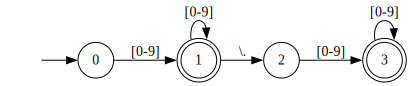
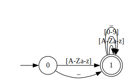
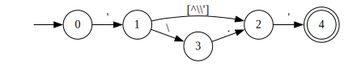
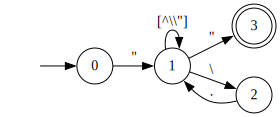
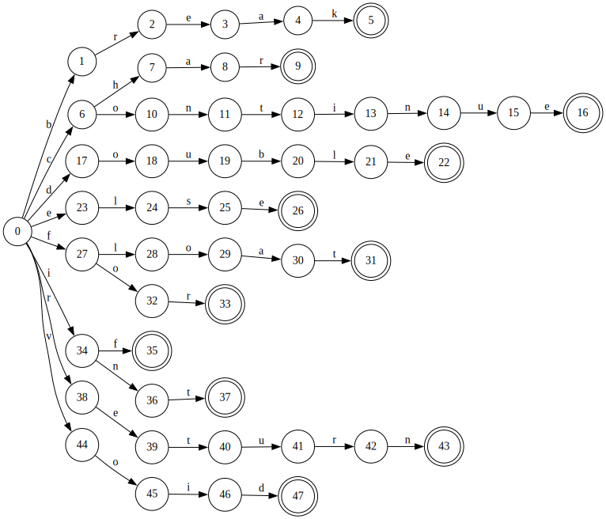
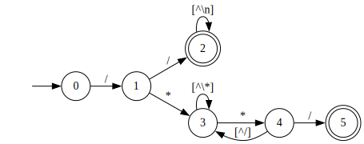
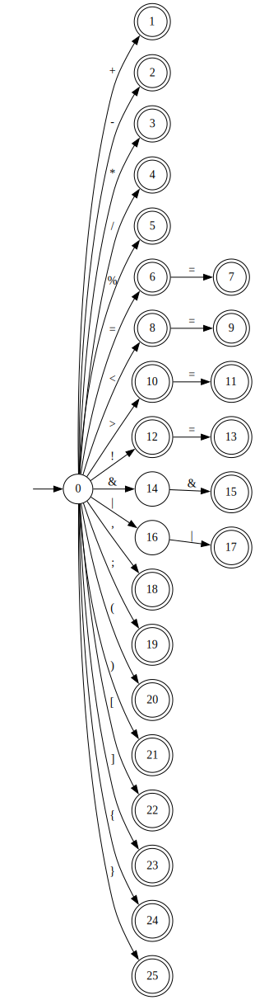
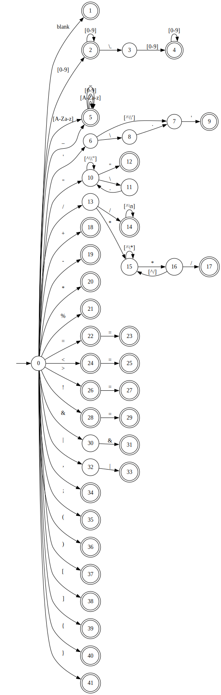
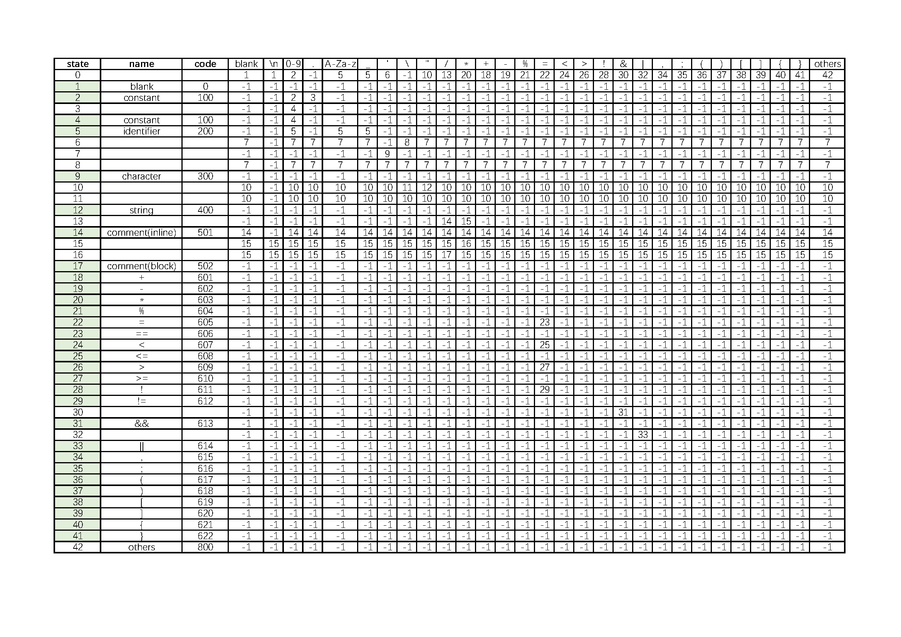

# 编译原理实验一：词法分析器

@Author：
@Date：2022-12-16

## 目录

- [编译原理实验一：词法分析器](#编译原理实验一词法分析器)
  - [目录](#目录)
  - [1. 实验目的](#1-实验目的)
  - [2. 实验内容](#2-实验内容)
  - [3. 方案 \& 实现](#3-方案--实现)
    - [3.1 整体设计](#31-整体设计)
    - [3.2 定义支持的词法单元](#32-定义支持的词法单元)
    - [3.3 文件读取](#33-文件读取)
    - [3.4 词法分析](#34-词法分析)
      - [3.4.1 实现思路](#341-实现思路)
      - [3.4.2 具体实现](#342-具体实现)
      - [3.4.3 合并 NFA 并转换为最小化 DFA](#343-合并-nfa-并转换为最小化-dfa)
      - [3.4.4 结果输出](#344-结果输出)
  - [4. 所涉及到的 FA](#4-所涉及到的-fa)
  - [5. 主要数据结构](#5-主要数据结构)
    - [5.1 词法分析器类](#51-词法分析器类)
    - [5.2 状态转换表](#52-状态转换表)
    - [5.3 保留字表](#53-保留字表)
  - [6. 核心算法](#6-核心算法)
  - [7. 测试用例](#7-测试用例)
  - [8. 问题 \& 解决方法](#8-问题--解决方法)
  - [9. 感受体会](#9-感受体会)

## 1. 实验目的

根据本学期所学知识，设计一个词法分析器程序，实现对自定义语言的词法分析，以文件形式输入待分析的源程序，输出词法分析结果，即 token 序列，同样以文件形式输出。

通过此实验，加深对词法分析原理的理解，和了解编译器的基本实现原理。

## 2. 实验内容

1. 逐字符扫描输入的源程序；
2. 识别其中的常数、标识符、字符、字符串、保留字、注释、运算符、分隔符、括号等；
3. 将能够识别的内容保存为 token；
4. 对于不能识别的错误单词，进行简单报错；
5. 将分析的结果输出到文件中。

## 3. 方案 & 实现

### 3.1 整体设计

词法分析器使用 C++ 语言实现，主要分为三个部分：文件读取、词法分析、输出结果。将使用到的函数、成员封装为一个类 `LexicalAnalyzer`，并在 `main` 函数中调用、测试。

### 3.2 定义支持的词法单元

拟定支持的词法为 C 语言词法的子集，包括：

- 常数：整数、小数（未支持科学计数法）
- 标识符：字母开头，后接字母、数字、下划线
- 字符：单引号包裹的单个字符，支持转义字符
- 字符串：双引号包裹的字符串，支持转义字符
- 保留字：`break`、`char`、`continue`、`double`、`else`、`float`、`for`、`if`、`int`、`return`、`void`
- 注释：支持行内注释和块注释两种类型
- 符号：`+`、`-`、`*`、`/`、`%`、`=`、`==`、`<`、`<=`、`>`、`>=`、`&&`、`||`、`!`、`!=`、`,`、`;`、`(`、`)`、`[`、`]`、`{`、`}`

### 3.3 文件读取

由用户输入待分析文件路径，使用 `ifstream` 打开、读取文件，文件内容保存在类的成员变量 `content_` 中。

### 3.4 词法分析

#### 3.4.1 实现思路

采用从 RE 到 NFA, 多个 NFA 合并后再转为最小化 DFA 的方法，列出最终的状态转换表，跟据表的内容进行匹配，返回对应的单词种别码。

#### 3.4.2 具体实现

*以下状态机的图示使用开源工具 [Graphviz](https://graphviz.org/) 配合 dot 语言绘制。*

1. 常数
    *例：123、123.456（不支持使用e、E的科学计数法）*
    `[0-9]+(\.[0-9]+)?`
    
1. 标识符
    *例：FooBar、_foo_bar、foo123*
    `[A-Za-z_][A-Za-z0-9_]*`
    
1. 字符
    *例：'a'、'\t'*
    `'([^\\']|\\.)'`
    
1. 字符串
    *例："foo bar"、"\\"foobar\\""*
    `"([^\\"]|(\\.))*"`
    
1. 保留字
    *例：*
    `break|char|continue|double|else|float|for|if|int|return|void`
    
1. 注释
    *例：*
    `/(/[^\n]*)|(\*([^*]|(\*[^/]))*\*/)`
    
1. 符号
    *例：*
    `\+|-|\*|/|<|<=|>|>=|==|!=|&&|\|\||=|;|,|\(|\)|\[|\]|\{|\}`
    

#### 3.4.3 合并 NFA 并转换为最小化 DFA



（省略了关键字部分的，在实现时关键字并没有通过 NFA 的方式来转换）

#### 3.4.4 结果输出

最后将分析结果以 token 序列的形式写入到文本文件中，文件名为 `“原文件名_result.txt”`。

```cpp
void LexicalAnalyzer::WriteResult(const string &file_path)
{
  ofstream file;
  string result_file_path =
      file_path.substr(0, file_path.length() - 4) + "_result.txt";
  file.open(result_file_path, ios::out);
  if (!file.is_open())
  {
    cout << "\nFailed to open the file!" << endl;
  }
  file << this->result_;
  file.close();
  cout << "\nResult has been written to \"" << result_file_path << "\"\n";
}
```

## 4. 所涉及到的 FA

见上一步，略。

## 5. 主要数据结构

### 5.1 词法分析器类

```cpp
class LexicalAnalyzer
{
 public:
  LexicalAnalyzer();
  ~LexicalAnalyzer();

  // 读取文件内容，存储在成员变量 content_ 中，返回是否成功：
  int ReadFile(const string &file_path);
  // 打印文件内容：
  void PrintContent();
  // 完成主要的词法分析任务，会调用下面私有的函数：
  void Analysis();
  // 将词法分析结果写入文件：
  void WriteResult(const string &file_path);

 private:
  // 一些辅助函数：
  // 判断字符是否为数字、字母：
  bool IsDigit(const char &ch);
  bool IsLetter(const char &ch);
  // 判断单词是否为保留字：
  int IsKeyword(const string &wd);
  // 返回字符的种类（对应转换表的列）：
  int GetType(const char &ch);
  // 根据状态码和单词返回编码：
  void GetToken(const int &st, const string &wd);
  // 输出格式为 <type[code], word>：
  void PrintToken(const string &tp, const int &cd, const string &wd);

  string content_;  // 存储文件内容
  string result_;  // 存储分析结果
  const int transfer_table_[43][29];  // 状态转换表
  const int state_codes_[43];  // 状态对应的编码（无编码置为-1）
  const string key_words_[11];  // 保留字表
  int id_cnt_;  // 标识符计数
  string id_table_[MAX_ID_NUM];  // 标识符表
};

```

### 5.2 状态转换表

根据上一步已经得到的最小化 DFA，列出状态转换表，并指定不同类别的编码，如下：



其中，state 对应着 DFA 中的状态编号，code 是种别码，表格中的数字是跳转到的状态编号，-1 表示结束，标记为绿色的状态为终态。

### 5.3 保留字表

```cpp
const string key_words_[11] = {"break", "char",   "continue", "double",
                               "else",  "float",  "for",      "if",
                               "int",   "return", "void"};
```

## 6. 核心算法

用于完成词法分析的主要函数如下：

Analysis() - 遍历文件内容，根据状态转换表进行状态转换，调用 GetToken() 函数，将结果写入 result_ 中。

GetToken() - 根据状态和单词，匹配对应的 token。

```cpp
void LexicalAnalyzer::Analysis()
{
  string word = "";
  char ch = this->content_[0];
  int ch_idx = 0;    // Current character index
  int word_len = 0;  // Current word length
  int state = 0;     // Current state
  while (ch_idx < this->content_.length())
  {
    ch = this->content_[ch_idx++];
    ++word_len;
    int next_state = this->transfer_table_[state][GetType(ch)];
    if (next_state == -1)
    {
      word = this->content_.substr(ch_idx - word_len, word_len - 1);
      GetToken(state, word);
      word_len = 0;
      state = 0;
      --ch_idx;
    }
    else
      state = next_state;
  }
}

void LexicalAnalyzer::GetToken(const int &st, const string &wd)
{
  int code = -1;
  if (st >= 0 && st <= 42) code = this->state_codes_[st];
  switch (code)
  {
    case -1:  // error
      PrintToken("ERROR", -1, wd);
      break;
    case 0:  // blank
      break;
    case 100:  // constant
      PrintToken("CONSTANT", 100, wd);
      break;
    case 200:  // identifier & keyword
    {
      int keyword_code = IsKeyword(wd);
      if (keyword_code != -1)  // keyword
      {
        string keyword_type = "KEYWORD(" + wd + ")";
        PrintToken(keyword_type, keyword_code, wd);
      }
      else  // identifier
      {
        for (int i = 0; i < id_cnt_; ++i)
        {
          if (id_table_[i] == wd)
          {
            // already exists
            PrintToken("IDENTIFIER", 201 + i, wd);
            return;
          }
        }
        // new identifier
        id_table_[id_cnt_] = wd;
        PrintToken("IDENTIFIER", 201 + id_cnt_++, wd);
      }
      break;
    }
    case 300:  // character
      PrintToken("CHARACTER", 300, wd);
      break;
    case 400:  // string
      PrintToken("STRING", 400, wd);
      break;
    case 501:  // inline comment
      PrintToken("INLINE_COMMENT", 501, wd);
      break;
    case 502:  // block comment
      PrintToken("BLOCK_COMMENT", 502, wd);
      break;
    case 601:  // operator
      PrintToken("OPERATOR(+)", 601, wd);
      break;
    case 602:
      PrintToken("OPERATOR(-)", 602, wd);
      break;
    case 603:
      PrintToken("OPERATOR(*)", 603, wd);
      break;
    case 604:
      PrintToken("OPERATOR(%)", 604, wd);
      break;
    case 605:
      PrintToken("OPERATOR(=)", 605, wd);
      break;
    case 606:
      PrintToken("OPERATOR(==)", 606, wd);
      break;
    case 607:
      PrintToken("OPERATOR(<)", 607, wd);
      break;
    case 608:
      PrintToken("OPERATOR(<=)", 608, wd);
      break;
    case 609:
      PrintToken("OPERATOR(>)", 609, wd);
      break;
    case 610:
      PrintToken("OPERATOR(>=)", 610, wd);
      break;
    case 611:
      PrintToken("OPERATOR(!)", 611, wd);
      break;
    case 612:
      PrintToken("OPERATOR(!=)", 612, wd);
      break;
    case 613:
      PrintToken("OPERATOR(&&)", 613, wd);
      break;
    case 614:
      PrintToken("OPERATOR(||)", 614, wd);
      break;
    case 615:  // delimiter
      PrintToken("DELIMETER(,)", 615, wd);
      break;
    case 616:
      PrintToken("DELIMETER(;)", 616, wd);
      break;
    case 617:  // bracket
      PrintToken("BRACKET(()", 617, wd);
      break;
    case 618:
      PrintToken("BRACKET())", 618, wd);
      break;
    case 619:
      PrintToken("BRACKET([)", 619, wd);
      break;
    case 620:
      PrintToken("BRACKET(])", 620, wd);
      break;
    case 621:
      PrintToken("BRACKET({)", 621, wd);
      break;
    case 622:
      PrintToken("BRACKET(})", 622, wd);
      break;
    default:
      PrintToken("OTHER", 800, wd);
  }
}
```

其余函数功能较为简单，不再赘述，详见源码。

## 7. 测试用例

输入文件：`./Test/test_1.txt`，内容如下：

```cpp
int main()
{
    char ch[100];
    int i;
    for (i=0;i<100;++i)
    {
        if (i < 50)
            ch[i]='a';
        else
            ch[i]='b';
    }
    return 0;
}
```

输出文件：`./Test/test_1_result.txt`，内容如下：

```
<KEYWORD(int)[709], int>
<IDENTIFIER[201], main>
<BRACKET(()[617], (>
<BRACKET())[618], )>
<BRACKET({)[621], {>
<KEYWORD(char)[702], char>
<IDENTIFIER[202], ch>
<BRACKET([)[619], [>
<CONSTANT[100], 100>
<BRACKET(])[620], ]>
<DELIMETER(;)[616], ;>
<KEYWORD(int)[709], int>
<IDENTIFIER[203], i>
<DELIMETER(;)[616], ;>
<KEYWORD(for)[707], for>
<BRACKET(()[617], (>
<IDENTIFIER[203], i>
<OPERATOR(=)[605], =>
<CONSTANT[100], 0>
<DELIMETER(;)[616], ;>
<IDENTIFIER[203], i>
<OPERATOR(<)[607], <>
<CONSTANT[100], 100>
<DELIMETER(;)[616], ;>
<OPERATOR(+)[601], +>
<OPERATOR(+)[601], +>
<IDENTIFIER[203], i>
<BRACKET())[618], )>
<BRACKET({)[621], {>
<KEYWORD(if)[708], if>
<BRACKET(()[617], (>
<IDENTIFIER[203], i>
<OPERATOR(<)[607], <>
<CONSTANT[100], 50>
<BRACKET())[618], )>
<IDENTIFIER[202], ch>
<BRACKET([)[619], [>
<IDENTIFIER[203], i>
<BRACKET(])[620], ]>
<OPERATOR(=)[605], =>
<CHARACTER[300], 'a'>
<DELIMETER(;)[616], ;>
<KEYWORD(else)[705], else>
<IDENTIFIER[202], ch>
<BRACKET([)[619], [>
<IDENTIFIER[203], i>
<BRACKET(])[620], ]>
<OPERATOR(=)[605], =>
<CHARACTER[300], 'b'>
<DELIMETER(;)[616], ;>
<BRACKET(})[622], }>
<KEYWORD(return)[710], return>
<CONSTANT[100], 0>
<DELIMETER(;)[616], ;>
<BRACKET(})[622], }>
```

经检查，匹配正确。

## 8. 问题 & 解决方法

在最初时的想法是全部使用 FA、状态转换表来实现，但在实际编写程序时，会发现像保留字可以用更简单直接的字符串匹配来实现，而不需要一个一个字符的进行状态转换。

另有一个问题是，对于多个符号组合的运算符，比如 “++”、“+=” 之类，直接按照状态转换表匹配会出现识别为两个单独的符号的问题，需要在程序设计中来纠正这一问题。

## 9. 感受体会

通过实验自己动手编写词法分析器，能够加深对词法分析过程的理解，对为什么要进行词法分析、如何进行词法分析有了更深的认识。
