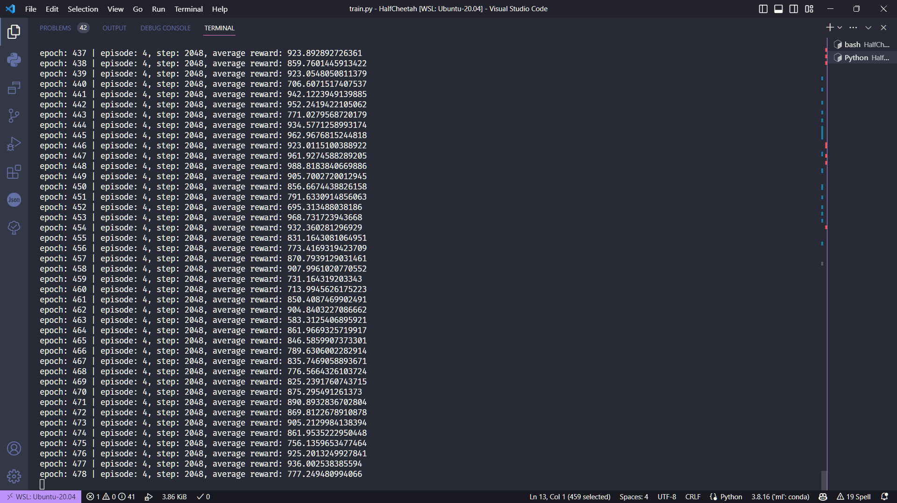

# <center>强化学习：期末课程设计-基础任务</center>

<center>NAME - STUDENT ID</center>
<center>June 8th, 2023</center>

## 目录

- [强化学习：期末课程设计-基础任务](#强化学习期末课程设计-基础任务)
  - [目录](#目录)
  - [目录结构](#目录结构)
  - [1 作业内容](#1-作业内容)
    - [1.1 论文翻译](#11-论文翻译)
    - [1.2 仿真](#12-仿真)
  - [2 实现过程](#2-实现过程)
    - [2.1 环境配置](#21-环境配置)
    - [2.2 演员-评论家网络](#22-演员-评论家网络)
    - [2.3 PPO算法](#23-ppo算法)
    - [2.4 训练过程](#24-训练过程)
    - [2.5 测试过程](#25-测试过程)
  - [3 复现方式](#3-复现方式)
  - [4 实验结果](#4-实验结果)
  - [5 小结](#5-小结)
    - [5.1 结果分析](#51-结果分析)
    - [5.2 问题与思考](#52-问题与思考)

## 目录结构

```bash
.
├── 论文翻译
│   ├── 近端策略优化算法.pdf     # 论文翻译
│   └── 源文件                  # markdown源文件
│       ├── PPO-Translate.md
│       └── assets              # 图片
│           └── ...
├── 报告
│   ├── 报告.pdf                # 报告
│   ├── 源文件                  # markdown源文件
│   │   ├── Report.md
│   │   └── assets
│   │       └── ...
│   └── test_video.mp4          # 测试视频
└── 代码
    ├── actor_critic.py         # AC & PPO实现
    ├── test.py                 # 测试
    ├── train.py                # 训练
    ├── ac_policy.pth           # AC网络参数
    └── reward.csv              # 训练奖励记录
```

## 1 作业内容

### 1.1 论文翻译

翻译经典论文 SCHULMAN J, WOLSKI F, DHARIWAL P, et al. **Proximal policy optimization algorithms**[J]. arXiv preprint arXiv:1707.06347, 2017, 1(2).

### 1.2 仿真

复现论文中仿真结果

- 从 7 个经典环境中选择一个：HalfCheetah，Hopper，InvertedDoublePendulum，InvertedPendulum，Reacher，Swimmer and Walker2d；
- 利用论文中提出的 PPO 方法实现任务；
- 将仿真结果与论文中的结果对比。

## 2 实现过程

### 2.1 环境配置

- 系统：Ubuntu 20.04
- Python版本：3.8.16
- CUDA版本：12.0
- 主要依赖库
  - PyTorch：2.0.0
  - gym：0.26.2
  - mujoco-py：2.1.2.14

### 2.2 演员-评论家网络

PPO 算法是诞生和作用在 Actor-Critic 框架下的，实际上是 AC 方法而不是单纯的 Policy Gradient 方法。

AC 方法的核心思想是将策略网络和价值网络结合起来，策略网络用于生成动作，价值网络用于评估状态的价值。

首先实现网络框架，对于 Actor 网络和 Critic 网络，都是三层全连接层，输入为状态，输出为动作和动作的价值：

```python
class ActorCritic(nn.Module):
    def __init__(self, obs_dim, act_dim, hidden_sizes):
        super(ActorCritic, self).__init__()
        self.log_std = nn.Parameter(torch.zeros(act_dim))  # 高斯分布的标准差

        # actor网络 - 输入：状态；输出：动作
        self.actor_fc1_ = nn.Linear(obs_dim, hidden_sizes[0])  # 全连接层
        self.actor_fc2_ = nn.Linear(hidden_sizes[0], hidden_sizes[1])
        self.actor_fc3_ = nn.Linear(hidden_sizes[1], act_dim)
        self.actor_fc3_.weight.data.mul_(0.1)
        self.actor_fc3_.bias.data.mul_(0.0)

        # critic网络 - 输入：状态；输出：动作的价值
        self.critic_fc1_ = nn.Linear(obs_dim, hidden_sizes[0])  # 全连接层
        self.critic_fc2_ = nn.Linear(hidden_sizes[0], hidden_sizes[1])
        self.critic_fc3_ = nn.Linear(hidden_sizes[1], 1)
        self.critic_fc3_.weight.data.mul_(0.1)
        self.critic_fc3_.bias.data.mul_(0.0)

        # 初始化权重
        self.apply(self.init_weights)
```

接下来是 ActorCritic 类中网络的前向传播和评估过程。

前向传播就是将状态作为输入，经过全连接层，输出动作和动作价值：

```python
class ActorCritic(nn.Module):
    def forward(self, obs):
        """前向传播"""
        # actor网络，输出动作的均值
        x = torch.tanh(self.actor_fc1_(obs))  # tanh激活
        x = torch.tanh(self.actor_fc2_(x))
        mean = self.actor_fc3_(x)  # 输出均值

        # 计算标准差，得到动作的分布
        log_std = self.log_std.expand_as(mean)
        std = torch.exp(log_std)
        act = torch.normal(mean, std)

        # critic网络，输出状态的价值估计
        val = torch.tanh(self.critic_fc1_(obs))  # tanh激活
        val = torch.tanh(self.critic_fc2_(val))
        val = self.critic_fc3_(val)  # 输出价值估计
        return val, act, mean
```

评估过程就是将状态作为输入，经过全连接层，输出动作和动作的价值，同时计算动作的概率和熵：

```python
class ActorCritic(nn.Module):
    def evaluate(self, obs, act):
        """评估动作的价值、概率、熵"""
        val, _, mean = self.forward(obs)  # 价值估计
        log_std = self.log_std.expand_as(mean)
        std = torch.exp(log_std)
        log_prob = self.log_normal_density(act, mean, log_std, std)
        dist_entropy = (0.5 + 0.5 * np.log(2 * np.pi)).sum(-1).mean()  # 熵
        return val, log_prob, dist_entropy

```

### 2.3 PPO算法

PPO 算法的核心思想是在更新策略网络时，使用剪切比率来限制策略网络的更新幅度，从而避免策略网络更新过大，导致策略网络的性能下降。

在论文中提到，PPO 算法使用 GAE 来计算优势估计，实现如下：

```python
def cal_gae(rewd, mask, gamma, lam, val):
    """计算GAE（广义优势估计）

    Args:
        rewd: 奖励值
        mask: 是否终止的标志
        gamma: 折扣因子
        lam: GAE参数
        val: 状态价值估计

    Returns:
        tar_list: 目标值
        adv_list: 优势估计值
    """
    val = val.detach().squeeze().cpu()
    mask = mask.detach().squeeze().cpu()
    rewd = rewd.detach().squeeze().cpu()

    # 初始化
    step_cnt = rewd.shape[0]
    tar_list = torch.zeros_like(rewd)
    adv_list = torch.zeros_like(rewd)
    running_tar = 0
    running_adv = 0
    pre_val = 0

    # 倒序遍历，计算每一个step的目标值和优势估计值
    for i in reversed(range(0, step_cnt)):
        running_tar = rewd[i] + mask[i] * gamma * running_tar
        delta = rewd[i] + mask[i] * gamma * pre_val - val[i]
        running_adv = delta + mask[i] * gamma * lam * running_adv
        tar_list[i] = running_tar
        pre_val = val[i]
        adv_list[i] = running_adv

    # 归一化
    adv_list = (adv_list - adv_list.mean()) / adv_list.std()
    return tar_list, adv_list
```

PPO 算法的核心是更新策略网络，使用了先前采样到的样本（存储在 mem 中）来更新策略网络，所使用的损失函数在论文中有详细介绍。PPO 使用 clip 截断的方式限制网络的更新幅度，在以下实现中有体现：

```python
def ppo_update(policy, mem, optim, k_epochs, batch_size, gamma, lam, clip_param, entropy_coef):
    """更新策略网络

    Args:
        policy: 策略网络
        mem: 经验池
        optim: 优化器
        k_epochs: 更新策略网络的次数
        batch_size: 批次大小
        gamma: 折扣因子
        lam: GAE参数
        clip_param: PPO算法的clip参数
        entropy_coef: 熵的系数

    Returns:
        policy: 更新后的策略网络
    """
    mem = np.asarray(mem, dtype=object)
    obs = torch.FloatTensor(np.vstack(mem[:, 0])).to(device)  # 状态
    act = torch.FloatTensor(np.vstack(mem[:, 1])).to(device)  # 动作
    rewd = torch.FloatTensor(list(mem[:, 2])).to(device)  # 奖励
    mask = torch.FloatTensor(list(mem[:, 3])).to(device)  # 终止标志
    val, _, _ = policy(obs)  # 策略网络输出

    # 计算GAE
    tar_list, adv_list = cal_gae(rewd, mask, gamma, lam, val)
    old_val, old_log_prob, _ = policy.evaluate(obs, act)  # 旧的状态价值、概率、熵
    arr = np.arange(obs.shape[0])

    # 更新策略网络
    for epoch in range(k_epochs):
        np.random.shuffle(arr)  # 乱序
        # 每次使用一个batch的数据进行更新
        for i in range(obs.shape[0] // batch_size):
            batch_idx = torch.LongTensor(arr[batch_size * i:batch_size * (i + 1)])
            # 获取一个batch的采样数据
            obs_sam = obs[batch_idx]
            act_sam = act[batch_idx]
            tar_sam = tar_list[batch_idx].to(device).unsqueeze(1)
            adv_sam = adv_list[batch_idx].to(device).unsqueeze(1)
            log_prob_sam = old_log_prob[batch_idx].detach().to(device)
            val_sam = old_val[batch_idx].detach().to(device)
            # 计算新的价值、概率、熵
            val_new, log_prob_new, dist_entropy = policy.evaluate(obs_sam, act_sam)
            # 剪切比率
            ratio = torch.exp(log_prob_new - log_prob_sam)
            clip_ratio = torch.clamp(ratio, 1.0 - clip_param, 1.0 + clip_param)
            # 计算损失
            surrogate1 = ratio * adv_sam
            surrogate2 = clip_ratio * adv_sam
            policy_loss = -torch.min(surrogate1, surrogate2).mean()
            clip_val = val_sam + torch.clamp(val_new - val_sam, -0.5, 0.5)
            c_loss1 = F.mse_loss(clip_val, tar_sam)
            c_loss2 = F.mse_loss(val_new, tar_sam)
            critic_loss = torch.max(c_loss1, c_loss2).mean()
            loss = policy_loss + 0.5 * critic_loss - entropy_coef * dist_entropy
            # 更新网络
            optim.zero_grad()
            loss.backward()
            optim.step()
```

### 2.4 训练过程

设置参数、创建环境以及 AC 网络的环节略过，从训练部分的循环开始。循环中的输出奖励、绘图、保存网络参数等操作也略过，具体代码详见所附代码文件。以下为训练部分的主要实现：

```python
for i in range(max_train_epoch):
    mem = deque()  # 经验池
    episode_cnt = 0
    step_cnt = 0
    temp_rewd_list = []
    # 在一个epoch中采样max_sample_step个样本
    while len(mem) < max_sample_size:
        episode_cnt += 1
        obs = env.reset()
        obs = obs[0]
        rewd_sum = 0
        # 进行一个episode的采样
        for _ in range(max_steps_per_episode):
            step_cnt += 1
            # 选择动作
            val, act, mean = ac_policy(torch.FloatTensor(obs).to(device))
            act = act.detach().cpu().numpy()
            # 与环境交互
            obs_nxt, rewd, term, trun, _ = env.step(act)
            done = term or trun
            # 存储经验
            if done:
                mask = 0
            else:
                mask = 1
            mem.append([obs, act, rewd, mask])
            rewd_sum += rewd
            obs = obs_nxt
            if done:
                break
        temp_rewd_list.append(rewd_sum)
    # 更新策略网络
    ppo_update(ac_policy, mem, optim, k_epochs, batch_size, gamma, lam, clip_param, entropy_coefficient)
```

### 2.5 测试过程

在训练过程中，网络参数被保存在 `ac_policy.pth` 文件中，创建完 AC 网络后加载网络参数：

```python
# 智能体
ac_policy = ActorCritic(obs_dim, act_dim, hidden_sizes).to(device)  # 演员-评论家策略
ac_policy.load_state_dict(torch.load('./ac_policy.pth'))
```

测试过程与训练过程类似，不同的是不再进行策略网络的更新，而是直接使用策略网络来选择动作，且设置只进行一轮测试，循环如下：

```python
done = False
rewd_sum = 0
step_cnt = 0
while not done:
    step_cnt += 1
    # 选择动作
    _, act, _ = ac_policy(torch.FloatTensor(obs).to(device))
    act = act.detach().cpu().numpy()
    # 与环境交互
    obs_nxt, rewd, term, trun, _ = env.step(act)
    done = term or trun
    rewd_sum += rewd
    if done:
        break
    # 更新状态
    obs = obs_nxt
# 打印结果
print(f'Steps: {step_cnt}, Reward: {rewd_sum}')
```

## 3 复现方式

AC 策略网络的构建以及训练、测试过程的代码实现已在上一节中给出。

以下为测试时的超参数设定：

```python
device = 'cuda:0'
render = False
hidden_sizes = [128, 128]  # 隐藏层维度（两个隐藏层）
learning_rate = 3e-4  # 学习率
k_epochs = 10  # 每次更新actor-critic策略的迭代次数
batch_size = 64  # 更新时的数据批次大小
gamma = 0.99  # 折扣因子
lam = 0.98  # GAE参数，调节长期和短期效应的比例
clip_param = 0.2  # PPO算法中的clip参数
entropy_coefficient = 0.01  # PPO算法中的熵系数
max_train_epoch = 500  # 最大训练轮数
max_sample_size = 2048  # 每轮最大采样步数
max_steps_per_episode = 512  # 每个episode最大步数（HalfCheetah内置的最大步数为1000）
```

## 4 实验结果

下图为训练中的控制台输出，输出的信息有当前轮数、在这一轮中训练了多少回合和总步数（在训练中发现环境似乎不会在出界、摔倒等情况终止，所以每次都到最大步数才停止）以及本轮中的平均得分：



下图为500轮训练中的得分情况（得分情况的分析写在下一节中）：


下图为10次测试中的得分情况：


录制的测试视频在目录下的 `test_video.mp4` 中，共 3 段，标注了得分。

## 5 小结

### 5.1 结果分析

在上一节中展示了训练得到的奖励曲线，与论文中的图像相比有一些出入，下面分析不一致的地方：

首先是横坐标的选取，论文中的横坐标选取的是 `step`，但是在我所写的训练过程中，每一轮进行多次的训练，按照 `step` 作为横坐标的方式会出现波浪式的曲线，所以选用 `epoch` 作为横坐标。

另一点是绘制的方式不相同，不太清楚论文中图像较为平滑的原因，以及浅色部分的含义，我在绘制时浅色部分是使用每一轮中多次训练的得分，曲线是取平均值的结果。

关于得分，HalfCheetah 环境中内置的最大步数是 1000，但训练时较慢，而且有出界、翻到但不终止的问题（可以看视频中的情况），因此我限制了每一回合的最大步数，设为 512。所以在得分上最终最好大概是在 1000 附近，而不是论文中的 2000 左右。在上一节中的测试部分没有限制最大步数，可以看到得分会高于训练时的得分，能够到 1000-1500 之间。

### 5.2 问题与思考

在训练时其实共进行了 700 轮，但在大约 500 轮后会出现得分下降，还有进一步下降的趋势，如图所示：


不太清楚具体原因，推测收敛到了局部最优解，或者超参数部分有设置不合理的地方，比如折扣因子和学习率。
