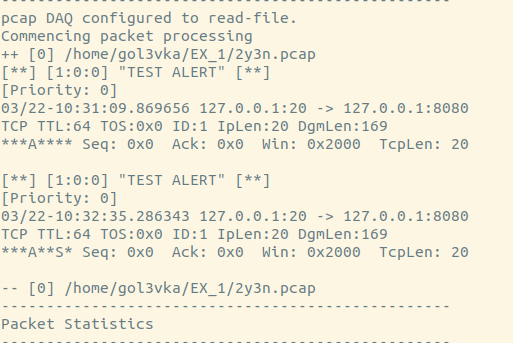
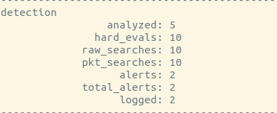

# idshwk1

## 要求
    detect a tcp packet with:
    · Destination Port at 8080, TCPFLAG ACK set, a string “I am IDS Homework I” in payload [100th byte-200th byte]
    · alert message “TEST ALERT”

## rules文件

```
alert tcp any any -> any 8080 ( msg:"TEST ALERT"; flags:A; content:"I am IDS Homework I"; offset:99; depth:101; sid:1)
```

## 测试

```python
pkg_1 = IP()/TCP(dport=8080, flags='A')/str('x' * 110 + 'I am IDS Homework I')  # 符合规则的包
pkg_2 = IP()/TCP(dport=1234, flags='A')/str('x' * 110 + 'I am IDS Homework I')  # 端口号不符合规则
pkg_3 = IP()/TCP(dport=8080, flags='SA')/str('x' * 110 + 'I am IDS Homework I')  # TCP FLAG为SYN+ACK，仍符合规则
pkg_4 = IP()/TCP(dport=8080, flags='A')/str('x' * 95 + 'I am IDS Homework I')  # payload不符合规则
pkg_5 = IP()/TCP(dport=8080, flags='A')/str('x' * 195 + 'I am IDS Homework I')  # payload不符合规则
```

其中有2个符合检测规则，3个不符合检测规则。保存为 `.pcap` 文件，使用 `snort -r <file>` 进行读取检测，结果如下：



可以看到构造的两个符合规则的包都被检测到了，发出了 `TEST ALERT` 的报警信息。以下是 Snort 的检测结果总结：



总共检测到5个包，其中2个触发报警，计入 log 文件中。
