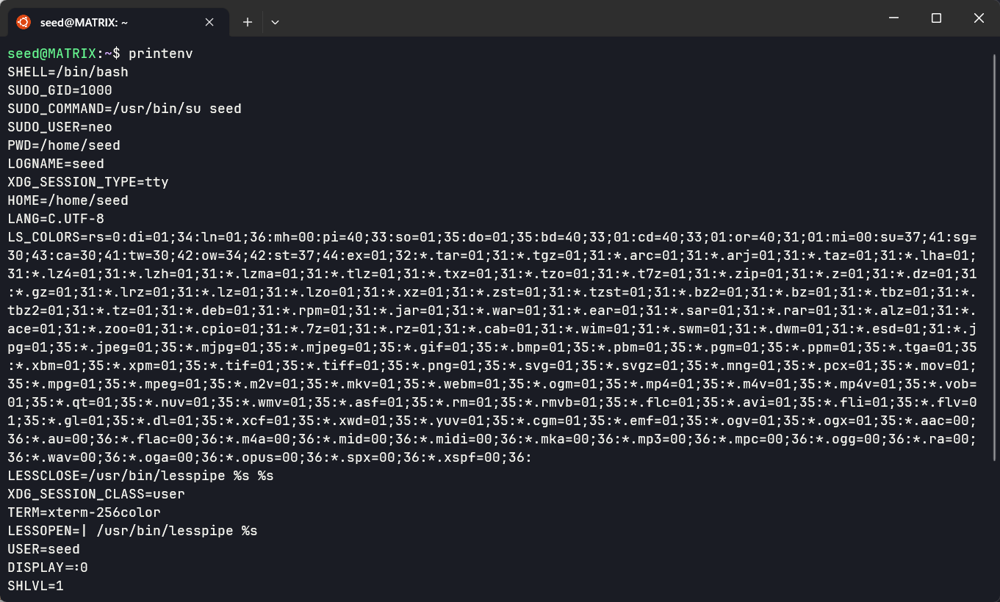
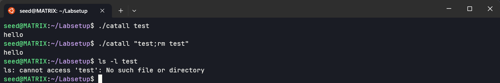

# 实验一：Environment Variable and Set-UID Program Lab

## Table of Contents

- [实验一：Environment Variable and Set-UID Program Lab](#实验一environment-variable-and-set-uid-program-lab)
  - [Table of Contents](#table-of-contents)
  - [1  Overview](#1--overview)
  - [2 Tasks](#2-tasks)
    - [2.1 Task 1: Manipulating Environment Variables](#21-task-1-manipulating-environment-variables)
    - [2.2 Task 2: Passing Environment Variables from Parent Process to Child Process](#22-task-2-passing-environment-variables-from-parent-process-to-child-process)
    - [2.3 Task 3: Environment Variables and execve()](#23-task-3-environment-variables-and-execve)
    - [2.4 Task 4: Environment Variables and system()](#24-task-4-environment-variables-and-system)
    - [2.5 Task 5: Environment Variable and Set-UID Programs](#25-task-5-environment-variable-and-set-uid-programs)
    - [2.6 Task 6: The PATH Environment Variable and Set-UID Programs](#26-task-6-the-path-environment-variable-and-set-uid-programs)
    - [2.7 Task 7: The LD PRELOAD Environment Variable and Set-UID Programs](#27-task-7-the-ld-preload-environment-variable-and-set-uid-programs)
    - [2.8 Task 8: Invoking External Programs Using system() versus execve()](#28-task-8-invoking-external-programs-using-system-versus-execve)
    - [2.9 Task 9: Capability Leaking](#29-task-9-capability-leaking)


## 1  Overview

环境变量在大多数操作系统中都有使用，它们是一种全局变量，可以被所有进程访问。在 Linux 中，环境变量是由 shell 程序维护的，每个进程都有一个环境变量表，用来存储环境变量。尽管环境变量影响着程序的行为，但许多编程人员对它的了解并不充分，在这种情况下，如果编程人员并不知道他们正在使用环境变量就会造成程序的不安全。

## 2 Tasks

### 2.1 Task 1: Manipulating Environment Variables

打印当前环境变量：

```bash
printenv
```




```bash
printenv PATH
```


添加环境变量 `FOO` 并打印，值为 `bar`：

```bash
export FOO=bar
echo $FOO
```


删除环境变量 `FOO` 并打印，值为空：

```bash
unset FOO
echo $FOO
```


### 2.2 Task 2: Passing Environment Variables from Parent Process to Child Process

编译并运行 `myprintenv.c`，打印当前环境变量并保存到 `child` 中，和 `printenv` 命令结果一致：

```bash
gcc -o a.out myprintenv.c
./a.out > child
cat child
```


修改 `myprintenv.c` 为打印父进程的环境变量：


再次编译并运行，打印父进程环境变量并保存到 `parent` 中：

```bash
gcc -o b.out myprintenv.c
./b.out > parent
cat parent
```


比较 `child` 和 `parent`，除得到的可执行文件名不同外，其他环境变量相同。表明使用 `fork()` 创建子进程时，子进程会继承父进程的环境变量：

```bash
diff child parent
```


### 2.3 Task 3: Environment Variables and execve()

编译并运行 `myenv.c`， 调用 `/usr/bin/env` 打印环境变量：

```bash
gcc -o t31.out myenv.c
./t31.out
```


打印结果为空，因为 `execve()` 函数的第 3 个参数 `envp` 为空，所以 `/usr/bin/env` 无法获取环境变量。修改代码，将参数设置为 `environ`，再次编译并运行，成功打印环境变量：

```bash
gcc -o t32.out myenv.c
./t32
```


### 2.4 Task 4: Environment Variables and system()

新建 `task4.c` 文件，内容如下。使用 `system()` 函数调用 `/usr/bin/env` 打印环境变量：


编译并运行，成功打印环境变量：

```bash
gcc -o t4.out task4.c
./t4.out
```


### 2.5 Task 5: Environment Variable and Set-UID Programs

新建 `task5.c` 文件，内容如下。打印当前进程的所有环境变量：


编译并运行，成功打印环境变量：

```bash
gcc -o t5.out task5.c
./t5.out
```


变更 `t5.out` 的所有者为 `root`，并设置 `set-uid` 位，查看权限：

```bash
sudo chown root t5.out
sudo chmod 4755 t5.out
ls -l t5.out
```


添加环境变量后，再次运行，可以看到除了 `LD_LIBRARY_PATH`，其他两个环境变量已经显示为所设置的值。是因为 `LD_LIBRARY_PATH` 是 `set-uid` 程序的安全环境变量，检测到 RUID 和 EUID 不一致时不会接受用户的设置：

```bash
export PATH="$PATH:/usr/local"
export LD_LIBRARY_PATH="$LD_LIBRARY_PATH:/usr/local/lib"
export FOO="bar"
./t5.out | grep -E "PATH|LD_LIBRARY_PATH|FOO"
```

### 2.6 Task 6: The PATH Environment Variable and Set-UID Programs

新建 `task6.c` 文件，内容如下：


编译并变更为 Set-UID 程序：

```bash
gcc -o t6.out task6.c
sudo chown root t6.out
sudo chmod 4755 t6.out
ls -l t6.out
```


使用 `zsh` 代替 `sh`，因为 `sh` 会阻止接下来的攻击：

```bash
sudo ln -sf /bin/zsh /bin/sh
```

编写恶意程序 `ls.c`，内容如下，打印存储密码的 `shadow` 文件（需要 root 权限）：


编译为 `ls` 程序：

```bash
gcc -o ls ls.c
```


运行 `t6.out` 会调用 `ls` 程序，但 `PATH` 未包含当前目录，所以会调用 `/bin/ls`，正常打印当前目录下的文件：

```bash
./t6.out
```


将当前目录添加到 `PATH` 中，再次运行 `t6.out`，会调用当前目录下的 `ls` 程序，打印 `shadow` 文件：

```bash
export PATH=.:$PATH
./t6.out
```


而作为普通用户，是无权查看 `shadow` 文件的：


### 2.7 Task 7: The LD PRELOAD Environment Variable and Set-UID Programs

新建 `mylib.c` 文件，内容如下：


编译为动态链接库，并将其路径添加到环境变量 `LD_PRELOAD` 中：

```bash
gcc -fPIC -g -c mylib.c
gcc -shared -o libmylib.so.1.0.1 mylib.o -lc
export LD_PRELOAD=./libmylib.so.1.0.1
```


新建 `myprog.c` 文件，内容如下，调用了 `sleep()` 函数：


编译为 `myprog` 程序：

```bash
gcc -o myprog myprog.c
```

**【1】普通用户运行常规程序**

```bash
./myprog
```

打印结果为 `I am not sleeping!`，因为 `LD_PRELOAD` 会优先加载动态链接库，所以 `sleep()` 函数被替换为 `libmylib.so.1.0.1` 中的 `sleep()` 函数：


**【2】普通用户运行 Set-UID 程序**

```bash
sudo chown root myprog
sudo chmod 4755 myprog
ls -l myprog
./myprog
```

在间隔 1 秒后，程序结束运行，说明调用的是系统的 `sleep()` 函数：


**【3】Root 用户设置环境变量并运行 Set-UID 程序**

```bash
sudo su
export LD_PRELOAD=./libmylib.so.1.0.1
./myprog
```

可以看到打印结果为 `I am not sleeping!`，说明 `LD_PRELOAD` 环境变量会被 `set-uid` 程序接受：


**【4】普通用户设置环境变量并运行 Set-UID user1 程序**

```bash
export LD_PRELOAD=./libmylib.so.1.0.1
sudo adduser user1
sudo chown user1 myprog
sudo chmod 4755 myprog
./myprog
```
在 1 秒后，程序结束运行，说明调用的是系统的 `sleep()` 函数：


综上可以得到，在 `set-uid` 程序中，`LD_PRELOAD` 环境变量只有在 `root` 用户设置时才会被接受，而其他 RUID 和 EUID 不一致的用户设置 `LD_PRELOAD` 环境变量时，`set-uid` 程序会忽略该环境变量，是出于动态链接库的安全考虑。

### 2.8 Task 8: Invoking External Programs Using system() versus execve()

编译 `catall.c` 程序，并将可执行文件的所有者设置为 `root`，并设置 `set-uid` 位：

```bash
gcc -o catall catall.c
sudo chown root catall
sudo chmod 4755 catall
ls -l catall
```


以 Root 用户身份创建 `test` 文件，内容为 `hello`，并设置权限为 `rwx------`，可以看到普通用户 seed 无法读取该文件：

```bash
sudo su
echo "hello" > test
chmod u=rwx,g=---,o=--- test
```


以普通用户身份运行 SET-UID 程序 `catall`，可以看到程序成功读取了 `test` 文件的内容。并且能够传入命令 `rm test`，成功删除了 `test` 文件（普通用户无权限删除）：

```bash
./catall test
./catall "test;rm test"
```



接下来修改 `catall.c`，使用 `execve()` 函数调用 `cat` 程序，编译并运行，设置为 SET-UID 程序，再对 `test` 文件进行测试：

```bash
vim catall.c
gcc -o catall catall.c
sudo chown root catall
sudo chmod 4755 catall
sudo su
echo "hello again" > test
chmod u=rwx,g=---,o=--- test
exit
./catall test
./catall "test;rm test"
```

可以看到程序仍能够读取 `test` 文件的内容，但会将 `test;rm test` 作为文件名，而不是执行命令：


### 2.9 Task 9: Capability Leaking

编译 `cap_leak.c` 程序，并设置为 SET-UID 程序：

```bash
gcc -o leak cap_leak.c
sudo chown root leak
sudo chmod 4755 leak
ls -l leak
```


在 /etc 目录下创建 `zzz` 文件，设置权限为 `rwx------`：

```bash
sudo su
touch /etc/zzz
chmod u=rwx,g=---,o=--- /etc/zzz
exit
ls -l /etc/zzz
```


运行 `leak` 程序，看到文件描述符为 3，接下来向文件描述符 3 写入数据，可以看到成功写入了 `/etc/zzz` 文件：

```bash
./leak
echo 123123123>&3
exit
sudo cat /etc/zzz
```


