#实验三：Return-to-libc Attack Lab

## Table of Contents
- [Table of Contents](#table-of-contents)
- [1 Overview](#1-overview)
- [2 Environment Setup](#2-environment-setup)
- [3 Lab Tasks](#3-lab-tasks)
  - [3.1 Task 1: Finding out the Addresses of libc Functions](#31-task-1-finding-out-the-addresses-of-libc-functions)
  - [3.2 Task 2: Putting the shell string in the memory](#32-task-2-putting-the-shell-string-in-the-memory)
  - [3.3 Task 3: Launching the Attack](#33-task-3-launching-the-attack)
  - [3.4 Task 4: Defeat Shell’s countermeasure](#34-task-4-defeat-shells-countermeasure)
  - [3.5 Task 5 (Optional): Return-Oriented Programming](#35-task-5-optional-return-oriented-programming)

## 1 Overview

## 2 Environment Setup

首先关闭地址随机化；在编译时带上关闭栈保护、不可执行栈的参数；替换`/bin/sh` 的软链接为`/bin/zsh`。

```bash
sudo sysctl -w kernel.randomize_va_space=0
gcc -m32 -fno-stack-protector example.c
gcc -m32 -z noexecstack -o test test.c
sudo ln -sf /bin/zsh /bin/sh
```

将存在漏洞的程序 `retlib.c` 编译为 32 位程序，带上前面提到的参数，并将其设置为 SUID 程序：

```bash
gcc -m32 -fno-stack-protector -z noexecstack -o retlib retlib.c
sudo chown root retlib
sudo chmod 4755 retlib
```

## 3 Lab Tasks

### 3.1 Task 1: Finding out the Addresses of libc Functions

使用 gdb 调试 `retlib` 程序，在 `main` 函数处设置断点，找到地址为 `0x12ef` 后继续运行：

```bash
gdb -q retlib
(gdb) b main
(gdb) r
```

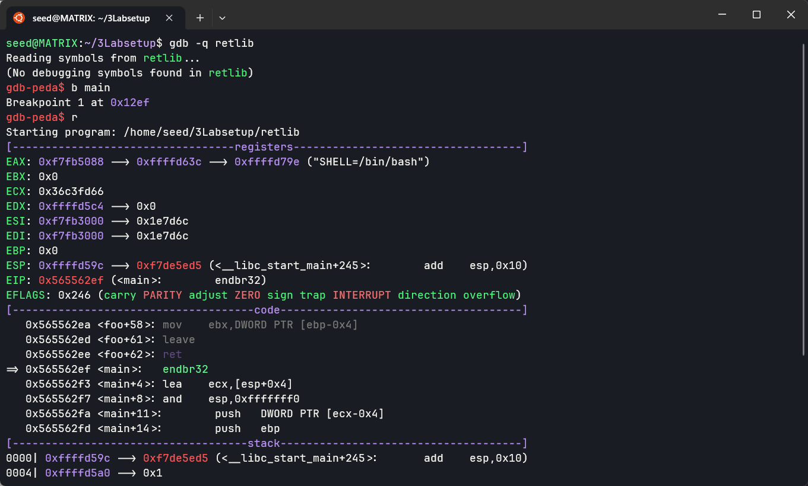

查看 `system` 和 `exit` 函数的地址，分别为 `0xf7e0c360` 和 `0xf7dfeec0`：

```bash
p system
p exit
```

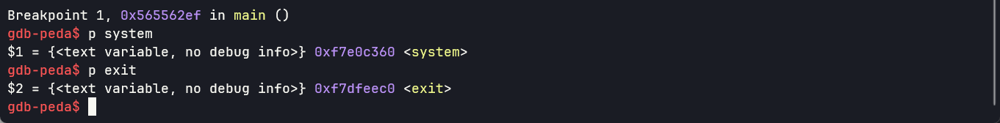


### 3.2 Task 2: Putting the shell string in the memory

将 `/bin/sh` 导出到环境变量中：

```bash
export MYSHELL=/bin/sh
printenv MYSHELL
```

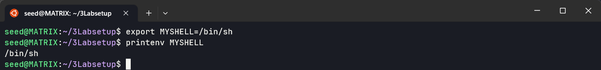

创建 `prtenv.c` 程序，用于打印环境变量的地址：

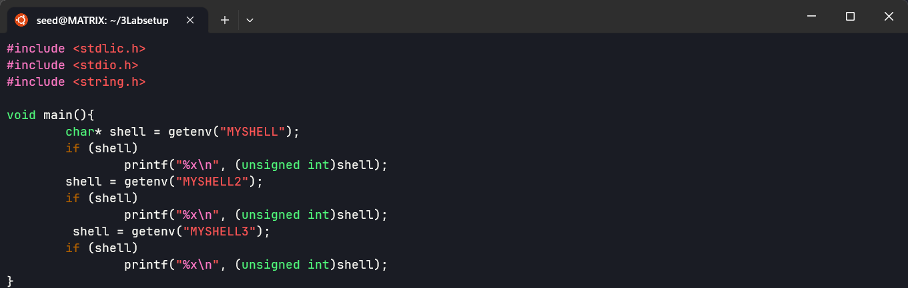

编译并运行，多次运行可以看到环境变量的地址是相同的 `ffffd7dc`，说明地址随机化已经关闭：

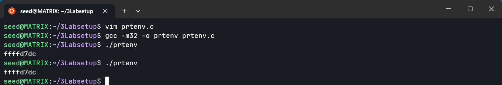

### 3.3 Task 3: Launching the Attack

创建 `badfile`，执行 `retlib` 程序，得到 `buffer` 和 `ebp` 的地址：

```bash
touch badfile
./retlib
```

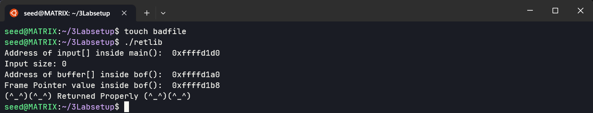

编辑 `exploit.py` 程序，将前面获取到的 `/bin/sh`、`system` 和 `exit` 的地址写入到程序；`Y` 的值为 `0xffffd1b8 - 0xffffd1a0 + 4`，`X` 的值为 `Y + 8`，`Z` 的值为 `Y + 4`：

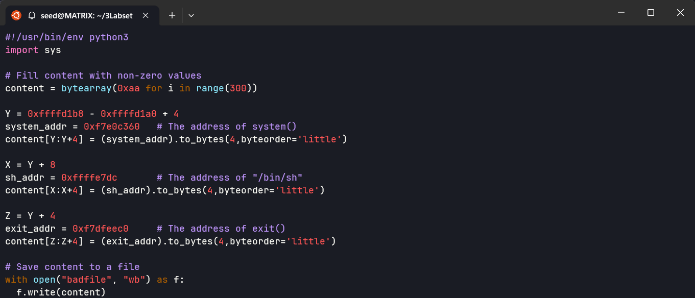

运行 `exploit.py` 程序，得到 `badfile` 文件，转换为十六进制格式，再次运行 `retlib` 程序，得到 shell。输入 `whoami` 命令，可以看到当前用户为 `root`：

```bash
./exploit.py
hexdump badfile
./retlib
whoami
```

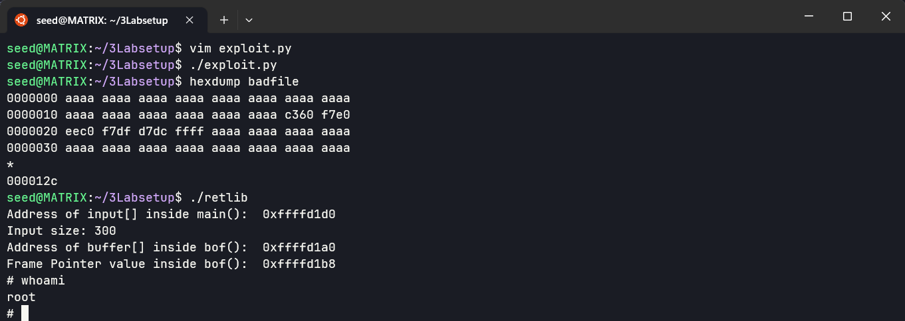

当不设置 `exploit.py` 中的 exit 地址时，还是可以得到 shell，但在退出时会出现内存错误：

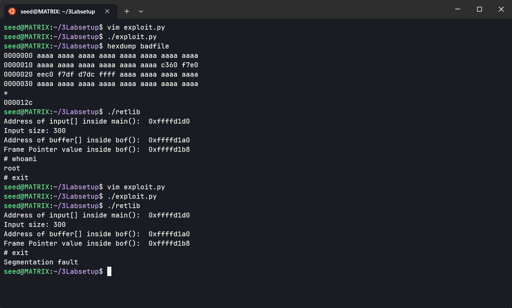

当修改 `retlib` 程序的名称后（长度发生变化），无法得到 shell，出现了命令无法识别的错误，是因为程序名会被写入到栈中，程序名长度发生变化后，栈中的地址也发生了变化，badfile 中的地址发生偏移：

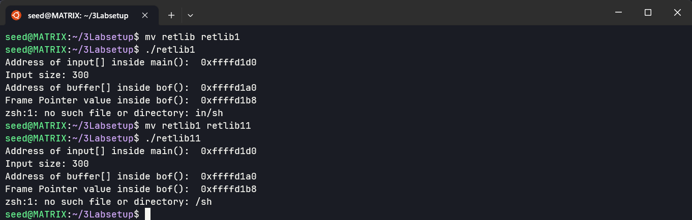

### 3.4 Task 4: Defeat Shell’s countermeasure

将 dash 重新链接回 /bin/sh：

```bash
sudo ln -sf /bin/dash /bin/sh
```

设置环境变量：

```bash
export MYSHELL2=/bin/bash
export MYSHELL3=-p
env | grep MYSHELL
```

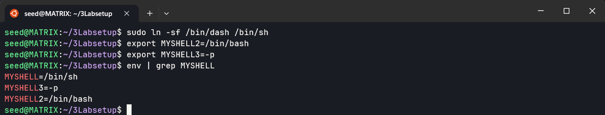

使用 `prtenv` 程序打印地址，看到 `/bin/sh` 的地址为 `ffffd7bd`，`/bin/bash` 的地址为 `ffffd7e8`，`-p` 的地址为 `ffffd7dc`：

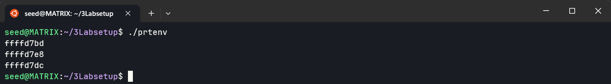

再次用 gdb 调试找到 `execv` 的地址为 `0xf7e93410`：

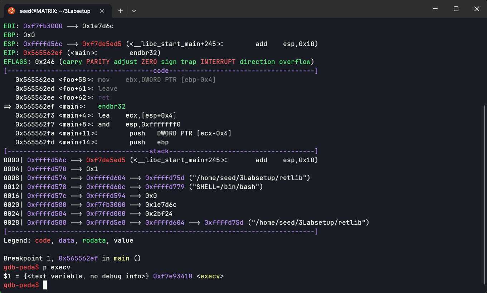

修改 `exploit.py` 的代码如下：

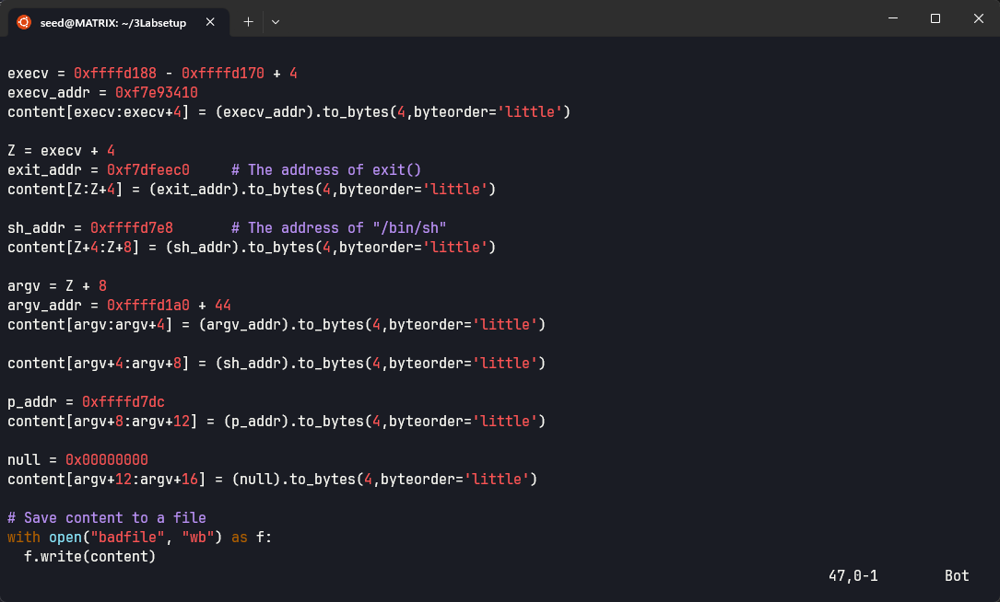

运行 `exploit.py` 程序，得到 `badfile` 文件，再运行 `retlib` 程序，得到 shell。输入 `whoami` 命令，可以看到当前用户为 `root`：

```bash
./exploit.py
./retlib
whoami
```

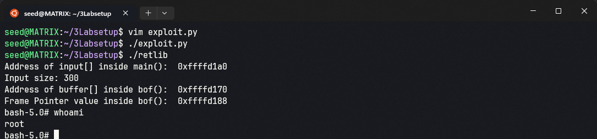

### 3.5 Task 5 (Optional): Return-Oriented Programming

使用 gdb 调试 `retlib` 程序，找到 `foo` 的位置为 `0x565562b0`，`execv` 的位置为 `0xf7e93410`，`exit` 的位置为 `0xf7dfeec0`：

```bash
gdb -q retlib
b main
r
p foo
p execv
p exit
```

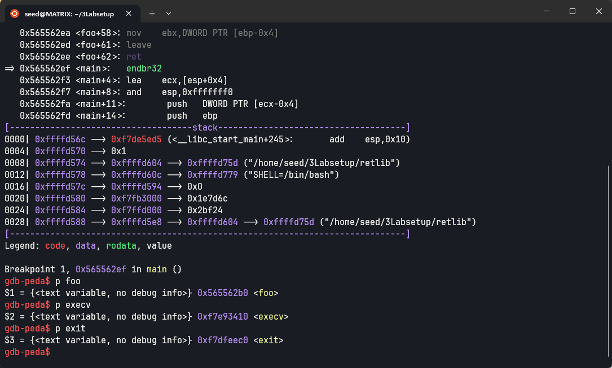

修改 `exploit.py` 的代码如下：

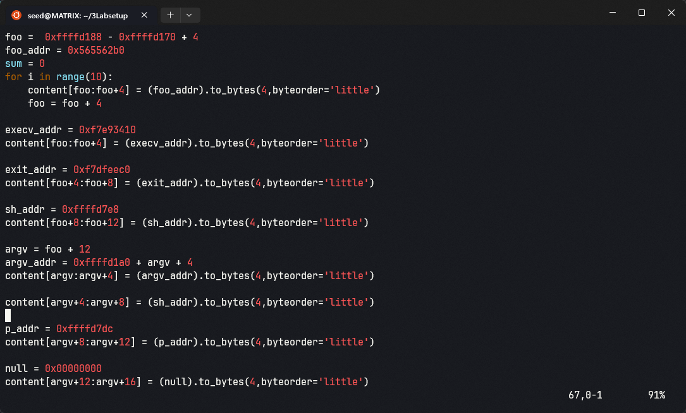

运行 `exploit.py` 程序，得到 `badfile` 文件，再运行 `retlib` 程序，可以看到程序在 `foo` 处运行了 10 次，然后退出，得到 shell：


