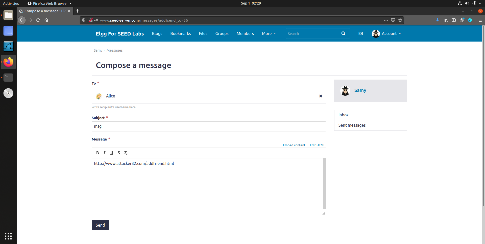

#实验四：Cross-Site Request Forgery (CSRF) Attack Lab

## Table of Contents
- [Table of Contents](#table-of-contents)
- [1 Overview](#1-overview)
- [2 Lab Environment Setup](#2-lab-environment-setup)
- [3 Lab Tasks: Attacks](#3-lab-tasks-attacks)
  - [3.1 Task 1: Observing HTTP Request](#31-task-1-observing-http-request)
  - [3.2 Task 2: CSRF Attack using GET Request](#32-task-2-csrf-attack-using-get-request)
  - [3.3 Task 3: CSRF Attack using POST Request](#33-task-3-csrf-attack-using-post-request)
- [4 Lab Tasks: Defense](#4-lab-tasks-defense)
  - [4.1 Task 4: Enabling Elgg’s Countermeasure](#41-task-4-enabling-elggs-countermeasure)
  - [4.2 Task 5: Experimenting with the SameSite Cookie Method](#42-task-5-experimenting-with-the-samesite-cookie-method)

## 1 Overview

## 2 Lab Environment Setup

进入 Labsetup 目录，创建并启动容器，查看各个容器的 id、ip，并写入到 hosts 文件中：

```bash
dcbuild
dcup
docker ps
sudo vim /etc/hosts
```


## 3 Lab Tasks: Attacks

### 3.1 Task 1: Observing HTTP Request

打开浏览器，启用插件 `HTTP Header Live`，访问 `www.seed-server.com`，查看 HTTP 请求头：


可以看到请求了页面、样式表、js、图片等资源。

登录 Samy 的账号，查看发起的请求：


查看用于登录的 POST 请求，可以看到是向 `http://www.seed-server.com/action/login` 发起的，载荷中包含了 token、时间戳、用户名和密码，且密码是明文传输的：


### 3.2 Task 2: CSRF Attack using GET Request

接下来准备构造 CSRF 攻击，构造一个页面，页面中包含一个图片，图片的 src 是一个 GET 请求，请求的内容是添加 Samy 为好友。首先需要获取到一个真正的请求，需要登录 Charlie 的账号，添加 Samy 为好友：


接下来查看刚刚发出的 GET 请求：

```url
http://www.seed-server.com/action/friends/add?friend=59&__elgg_ts=1693549296&__elgg_token=fWHHA0KeGYVBWKXsaRXqyw&__elgg_ts=1693549296&__elgg_token=fWHHA0KeGYVBWKXsaRXqyw
```

将前半部分 `http://www.seed-server.com/action/friends/add?friend=59` 作为图片的 src，构造页面：


将攻击页面 `www.attacker32.com/addfriend.html` 发送给 Alice，让其访问：




Alice 点击链接后，Samy 就被添加为好友了：


### 3.3 Task 3: CSRF Attack using POST Request

接下来要做的是将 Alice 的简介修改为 `Samy is my Hero`，与上一个任务不同的是，这次攻击需要使用 POST 请求。同样先登录自己的账户，修改简介查看请求：


可以看到请求的 url 是 `http://www.seed-server.com/action/profile/edit`，请求的方法是 POST，请求的载荷如下：

```plaintext
__elgg_token=siYuIY0-3jBj1n_bxXnQ4g&
__elgg_ts=1693551157&name=Samy&
description=&accesslevel[description]=2&
briefdescription=123&accesslevel[briefdescription]=2&
location=&accesslevel[location]=2&
interests=&accesslevel[interests]=2&
skills=&accesslevel[skills]=2&
contactemail=&accesslevel[contactemail]=2&
phone=&accesslevel[phone]=2&
mobile=&accesslevel[mobile]=2&
website=&accesslevel[website]=2&
twitter=&accesslevel[twitter]=2&
guid=59
```

获取 Alice 的 guid 为 56：


修改攻击页面 `editprofile.html`，填入 Alice 的信息以及所要修改的简介内容，以及把简历的可见范围改为 2（公开）：


再次向 Alice 发送攻击页面，让其访问：


简介成功修改为 `Samy is my Hero`：


问题一：如何获取 Alice 的 guid？

答：在 Samy 的账号中，向 Alice 发送消息或者添加 Alice 为好友，然后查看请求，就可以看到 Alice 的 guid 为 56.

问题二：在没有明确的攻击对象的情况下，能否构造一个通用的 CSRF 攻击页面？

答：是不可以的。可以进行以下测试：Samy 将上面填入了 Alice 的 guid 的页面再发送给 Charlie 的账号，登上 Charlie 账号访问页面，由于 guid 不匹配，会提示没有权限修改。也就是说攻击页面上的 guid 必须与访问者的一致才能成功。而且 session 中没有附带 guid 的信息，所以页面也无法实时获取：


## 4 Lab Tasks: Defense

### 4.1 Task 4: Enabling Elgg’s Countermeasure

进入 elgg-10.9.0.5 容器，修改配置文件，将 validate() 函数下的第一个 return 注释掉，打开保护措施：


登入 Alice 的账号，删除掉 Samy 的好友后再次点击链接：


可以看到出现了表单缺少 token 和时间戳的提示，攻击失败：


是因为当开启保护措施后，token 和时间戳将不会再附带在 url 中，而作为攻击者又是无法获取到这些值的。Elgg 检查到缺少或不匹配时，会拒绝请求返回错误。

### 4.2 Task 5: Experimenting with the SameSite Cookie Method

访问 `www.example32.com`，点击链接 A，里面的链接和表单都是发往相同域名的，所以几个 cookie 都被附带着：


而点击链接 B，则是跳转到了 `www.attacker32.com`，再点击链接或提交表单（GET）时，是从 `www.attacker32.com` 发出的请求，所以 cookie 中缺失了 cookie-strict，并被识别为跨站请求：


而发起 POST 请求时，lax 和 strict 都不存在：


