#实验七：MD5 Collision Attack Lab

## Table of Contents
- [Table of Contents](#table-of-contents)
- [1 Introduction](#1-introduction)
- [2 Lab Tasks](#2-lab-tasks)
  - [2.1 Task 1: Generating Two Different Files with the Same MD5 Hash](#21-task-1-generating-two-different-files-with-the-same-md5-hash)
  - [2.2 Task 2: Understanding MD5’s Property](#22-task-2-understanding-md5s-property)
  - [2.3 Task 3: Generating Two Executable Files with the Same MD5 Hash](#23-task-3-generating-two-executable-files-with-the-same-md5-hash)
  - [2.4 Task 4: Making the Two Programs Behave Differently](#24-task-4-making-the-two-programs-behave-differently)


## 1 Introduction

## 2 Lab Tasks

### 2.1 Task 1: Generating Two Different Files with the Same MD5 Hash

任务一的目标是生成两个不同的文件，但是它们的 MD5 值相同。使用到 md5collgen 工具，该工具可以根据指定的前缀生成两个 MD5 值相同的文件。

创建 prefix.txt 文件，内容任意，这里写入 `Hello World!`，然后执行命令：

```shell
echo "Hello World!" > prefix.txt
md5collgen -p prefix.txt -o out1.bin out2.bin
```

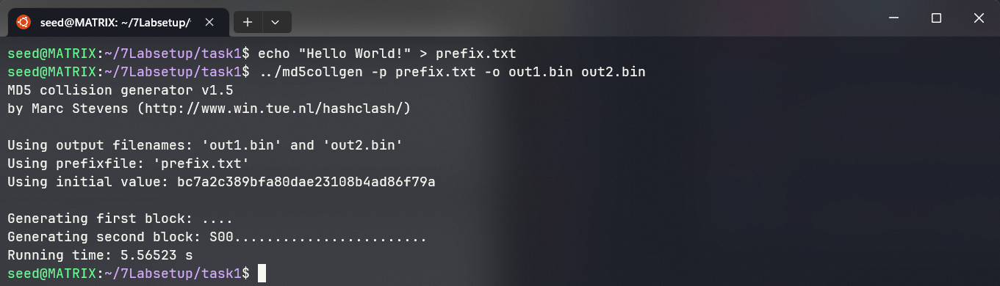

两个文件是否相同：

```shell
diff -q out1.bin out2.bin
```

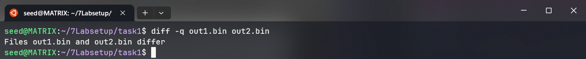

比较两个文件的 MD5 值，可以看到是相同的：

```shell
md5sum out1.bin out2.bin
```

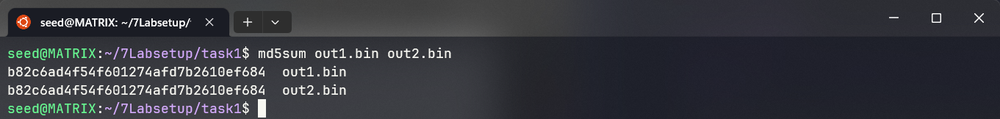

问题1：如果 prefix.txt 文件内容长度不是 64 的倍数，会发生什么？

在刚才的过程中写入的内容长度是 12，不是 64 的倍数，查看 out1.bin 的内容：

```shell
hexdump -C out1.bin
```

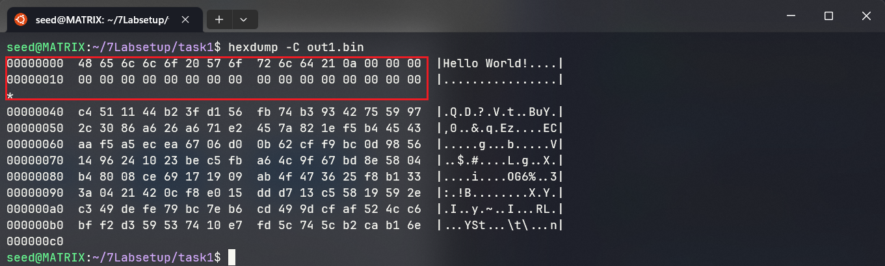

可以看到是被填充了 52 个 0x00 字节，使得文件长度达到 64 的倍数。

问题2：创建一个内容长度恰好为 64 字节的前缀文件，会发生什么？

创建 prefix.txt 文件，内容长度为 63 个 A（文件末尾会有一个结束符）：

```shell
echo "AAAAAAAAAAAAAAAAAAAAAAAAAAAAAAAAAAAAAAAAAAAAAAAAAAAAAAAAAAAAAAA" > prefix.txt
```

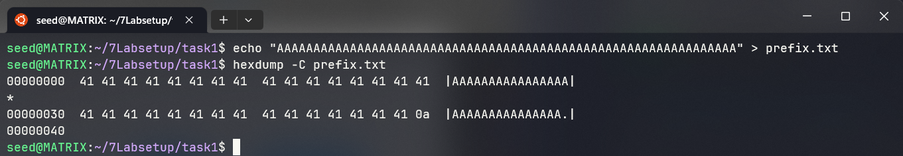

再次执行命令：

```shell
md5collgen -p prefix.txt -o out1.bin out2.bin
hexdump -C out1.bin
```

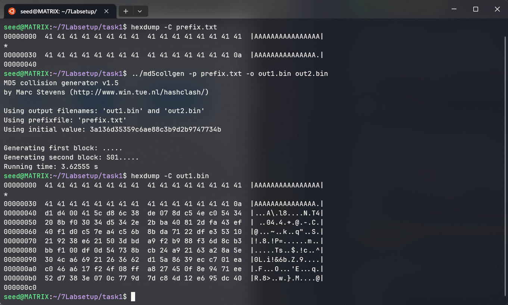

可以看到这次没有再填充。

问题3：生成的两个文件除去前缀之外的 128 个字节是否完全不同？

比对两个文件的十六进制内容：

```shell
hexdump -C out1.bin
hexdump -C out2.bin
```

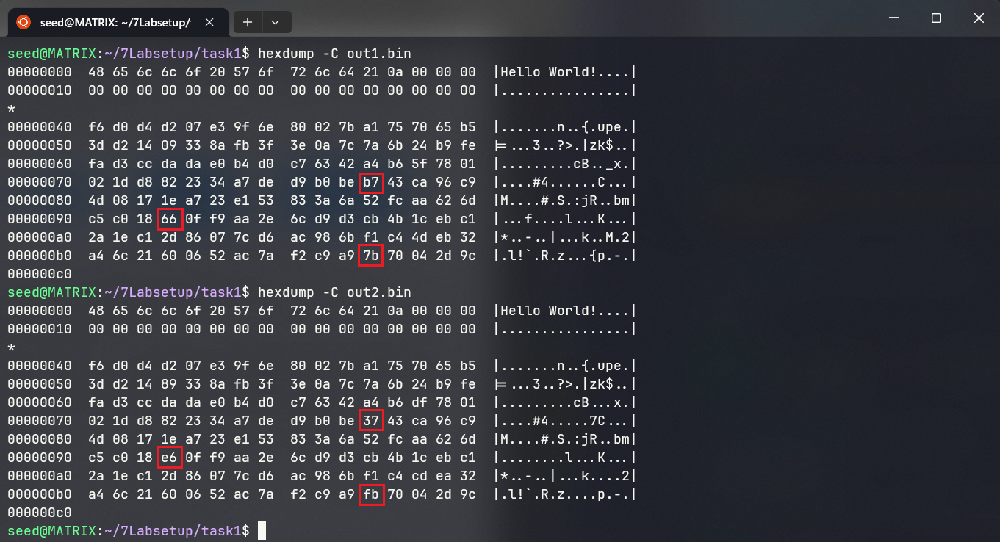

可以看到其实大部分内容是相同的，只有中间的一部分不同。

### 2.2 Task 2: Understanding MD5’s Property

MD5 算法的原理是将输入的数据分成若干个 64 字节的块，然后对每个块进行处理，最后将每个块的结果合并起来，得到最终的结果。

那么可以得到如果两段数据（要求长度为 64 字节的倍数）的 MD5 值相同，再在它们的后面添加相同的数据，那么它们的 MD5 值仍然相同。

向 out1.bin 和 out2.bin 文件后面添加相同的数据，比较它们的 MD5 值：

```shell
echo "Hello Again!" >> out1.bin
echo "Hello Again!" >> out2.bin
md5sum out1.bin out2.bin
```

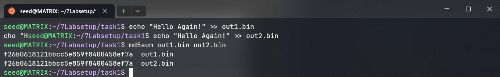

可以看到它们的 MD5 值仍然相同。

### 2.3 Task 3: Generating Two Executable Files with the Same MD5 Hash

任务三的目标是生成两个可执行文件，但是它们的 MD5 值相同。

在程序中声明一个大于 128 字节（使用 md5collgen 生成的后缀长度）的变量，将可执行程序的前 64 字节（或 64 字节的倍数）作为前缀，使用 md5collgen 生成后缀填入变量。

程序如下，为了方便定位变量 xyz 的位置，将其内容设置为 200 个 0x41（A）：

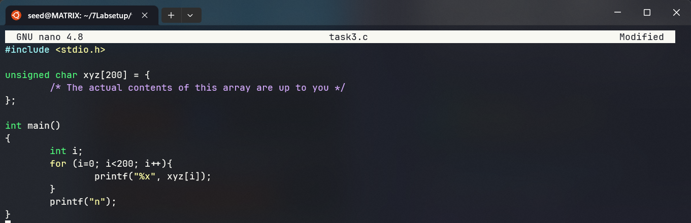

编译为可执行文件，查看十六进制内容：

```shell
gcc -o task3 task3.c
hexdump -C task3
```

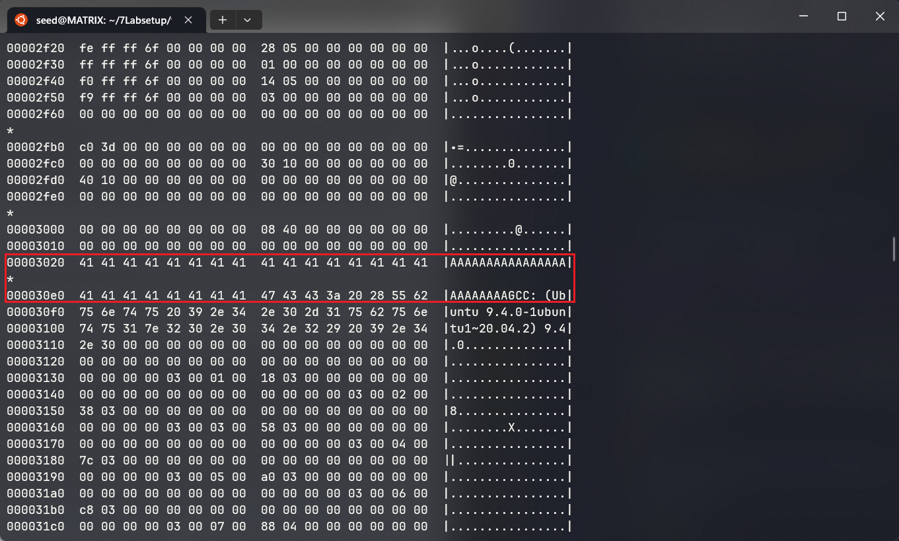

找到了 xyz 的起始位置为 0x3020，3*16^3+2*16^1=12352，正好是 64 的倍数，所以直接取前 12352 字节作为前缀，使用 md5collgen 生成两个 MD5 值相同的文件（12480 字节），再把可执行程序中剩下的部分接上。

```shell
head -c 12352 task3 > prefix.txt
md5collgen -p prefix.txt -o out1.bin out2.bin
tail -c +12481 task3 >> out1.bin
tail -c +12481 task3 >> out2.bin
```

执行两个程序，比较输出内容，是不相同的：

```shell
chmod +x out1.bin out2.bin
./out1.bin > out1.txt
./out2.bin > out2.txt
diff -q out1.txt out2.txt
```

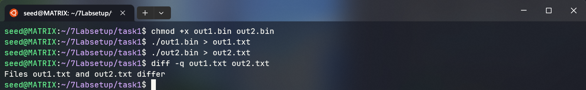

再比较两个程序的 MD5 值，可以看到是相同的：

```shell
md5sum out1.bin out2.bin
```

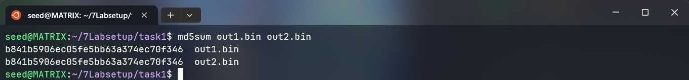

### 2.4 Task 4: Making the Two Programs Behave Differently

任务四的目标是同样生成两个可执行文件，但是它们的功能行为不同。

做法是创建两个数组，若两个数组的内容不同，则执行恶意代码，否则执行正常代码。

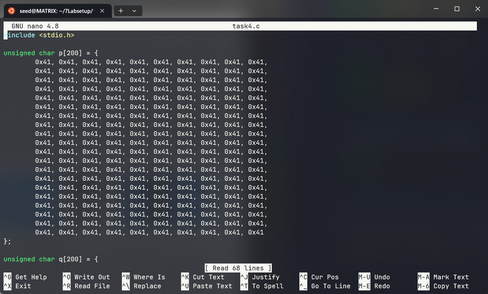

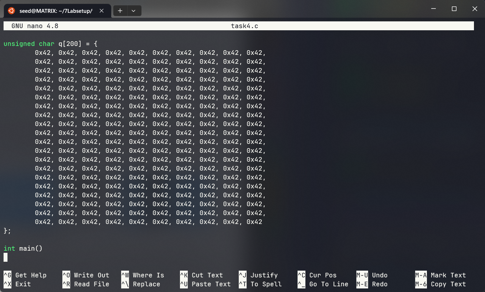

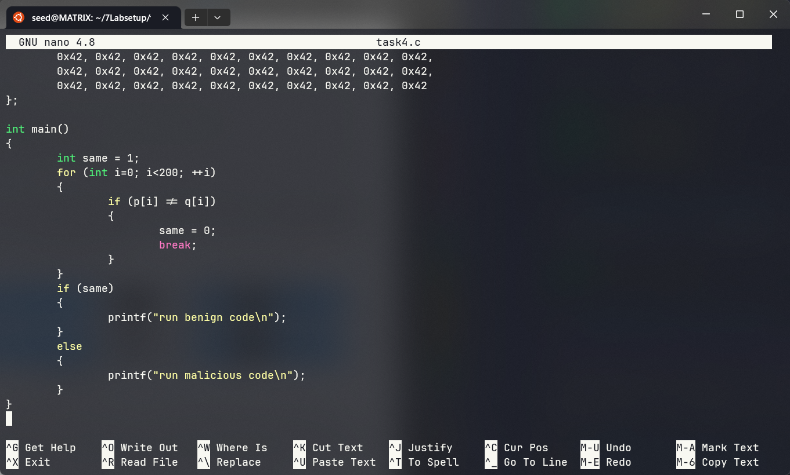

编译代码，查看十六进制内容，找到两个数组的位置：

```shell
gcc -o task4 task4.c
hexdump -C task4
```

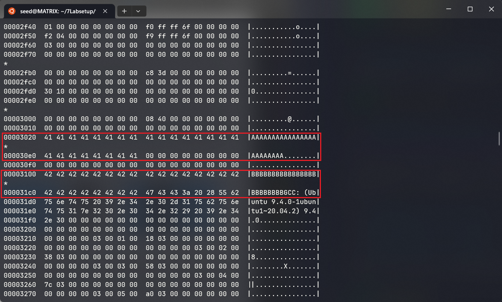

分别在 0x3020 和 0x3100 的位置。

按照和上一节相同的步骤，以前 12352 字节作为前缀，使用 md5collgen 生成两个 MD5 值相同的文件（12480 字节），提取出 128 字节的后缀分别作为 p 和 q

```shell
head -c 12352 task4 > prefix.txt
md5collgen -p prefix.txt -o out1.bin out2.bin
```

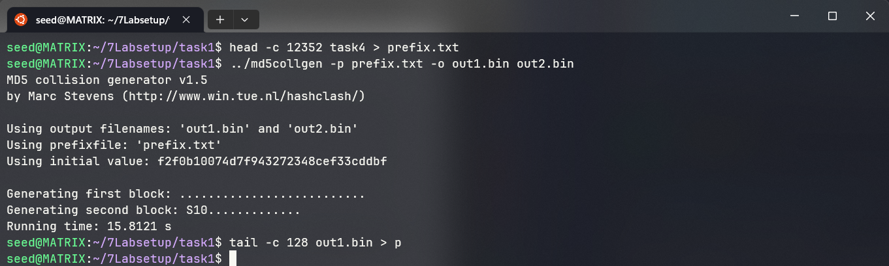

接下来构造包含 q 的后半部分内容：

```bash
tail -c +12481 task4 > suffix.txt
hexdump -C suffix.txt
```

找到 q 的位置为 0x0040，十进制为 64：

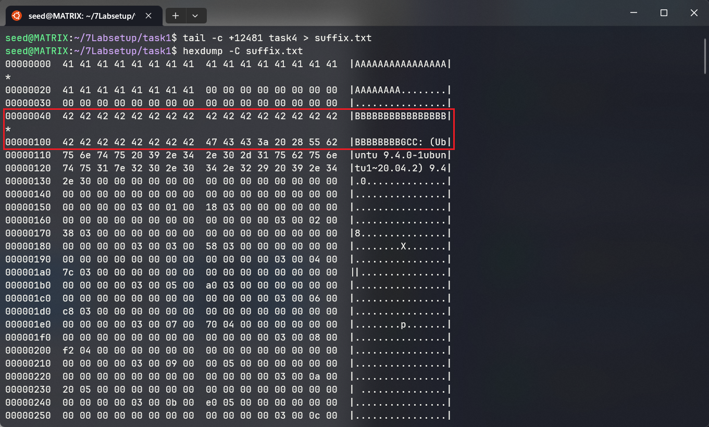

提取、构造 p 的内容：

```bash
tail -c 160 out1.bin > p
head -c 40 suffix.txt >> p
```

拼接两个不同的前缀、p、剩余的后缀

```bash
tail -c +265 suffix.txt > suffix-1.txt
head -c 64 suffix.txt >> out1.bin
head -c 64 suffix.txt >> out2.bin
cat out1.bin p suffix-1.txt > out1
cat out2.bin p suffix-1.txt > out2
```

赋予权限，执行：

```bash
chmod +x out1 out2
./out1
./out2
```

成功执行了不同的操作：

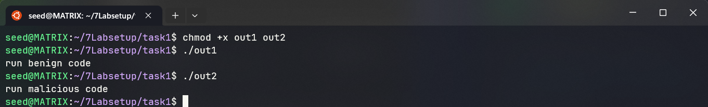
